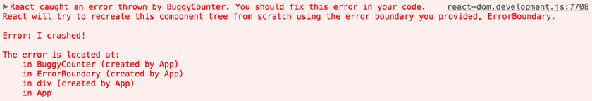
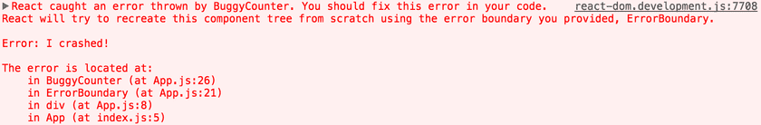

# React学习文档（高级指引）

[TOC]


## Fragments

React 中的一个常见模式是一个组件返回多个元素。Fragments 允许你将子列表分组，而无需向 DOM 添加额外节点。

```javascript
render() {
  return (
    <React.Fragment>
      <ChildA />
      <ChildB />
      <ChildC />
    </React.Fragment>
  );
}
```

### 动机

一种常见模式是组件返回一个子元素列表。以此 React 代码片段为例：

```javascript
class Table extends React.Component {
  render() {
    return (
      <table>
        <tr>
          <Columns />
        </tr>
      </table>
    );
  }
}
```

`<Columns />` 需要返回多个 `<td>` 元素以使渲染的 HTML 有效。如果在 `<Columns />` 的 `render()` 中使用了父 div，则生成的 HTML 将无效。

```javascript
class Columns extends React.Component {
  render() {
    return (
      <div>
        <td>Hello</td>
        <td>World</td>
      </div>
    );
  }
}
```

得到一个 `<Table />` 输出：

```html
<table>
  <tr>
    <div>
      <td>Hello</td>
      <td>World</td>
    </div>
  </tr>
</table>
```

Fragments 解决了这个问题。

### 用法

```javascript
class Columns extends React.Component {
  render() {
    return (
      <React.Fragment>
        <td>Hello</td>
        <td>World</td>
      </React.Fragment>
    );
  }
}
```

这样可以正确的输出 `<Table />`：

```html
<table>
  <tr>
    <td>Hello</td>
    <td>World</td>
  </tr>
</table>
```

### 短语法

你可以使用一种新的，且更简短的语法来声明 Fragments。它看起来像空标签：

```javascript
class Columns extends React.Component {
  render() {
    return (
      <>
        <td>Hello</td>
        <td>World</td>
      </>
    );
  }
}
```

你可以像使用其他任意元素一样使用 `<> </>`，但它并不支持 key 或属性。

### 带 key 的 Fragments

使用显式 `<React.Fragment>` 语法声明的片段可能具有 key。一个使用场景是将一个集合映射到一个 Fragments 数组 - 举个例子，创建一个描述列表：

```javascript
function Glossary(props) {
  return (
    <dl>
      {props.items.map(item => (
        // 没有`key`，React 会发出一个关键警告
        <React.Fragment key={item.id}>
          <dt>{item.term}</dt>
          <dd>{item.description}</dd>
        </React.Fragment>
      ))}
    </dl>
  );
}
```

`key` 是唯一可以传递给 `Fragment` 的属性。未来我们可能会添加对其他属性的支持，例如事件。

## 代码分割

### 打包

大多数 React 应用都会使用 [Webpack](https://webpack.docschina.org/)，[Rollup](https://rollupjs.org/) 或 [Browserify](http://browserify.org/) 这类的构建工具来打包文件。打包是一个将文件引入并合并到一个单独文件的过程，最终形成一个 “bundle”。接着在页面上引入该 bundle，整个应用即可一次性加载。

#### 示例

**App文件：**

```javascript
// app.js
import { add } from './math.js';

console.log(add(16, 26)); // 42
```

```javascript
// math.js
export function add(a, b) {
  return a + b;
}
```

**打包后文件：**

```javascript
function add(a, b) {
  return a + b;
}

console.log(add(16, 26)); // 42
```

> 最终你打包后的文件可能看起来会和上面的例子区别很大。

如果你正在使用 [Create React App](https://create-react-app.dev/)，[Next.js](https://nextjs.org/)，[Gatsby](https://www.gatsbyjs.org/)，或者类似的工具，你可以直接使用内置的 Webpack 配置来构建你的应用。

如果你没有使用这类工具，你就需要自己来进行配置。例如，查看 Webpack 文档上的[安装](https://webpack.docschina.org/guides/installation/)和[入门教程](https://webpack.docschina.org/guides/getting-started/)。

### 代码分割

打包是个非常棒的技术，但随着你的应用增长，你的代码包也将随之增长。尤其是在整合了体积巨大的第三方库的情况下。你需要关注你代码包中所包含的代码，以避免因体积过大而导致加载时间过长

为了避免搞出大体积的代码包，在前期就思考该问题并对代码包进行分割是个不错的选择。 代码分割是由诸如 [Webpack](https://webpack.docschina.org/guides/code-splitting/)，[Rollup](https://rollupjs.org/guide/en/#code-splitting) 和 Browserify（[factor-bundle](https://github.com/browserify/factor-bundle)）这类打包器支持的一项技术，能够创建多个包并在运行时动态加载。

对你的应用进行代码分割能够帮助你“懒加载”当前用户所需要的内容，能够显著地提高你的应用性能。尽管并没有减少应用整体的代码体积，但你可以避免加载用户永远不需要的代码，并在初始加载的时候减少所需加载的代码量。

#### `import()`

在你的应用中引入代码分割的最佳方式是通过动态 `import()` 语法。

**使用之前：**

```javascript
import { add } from './math';

console.log(add(16, 26));
```

**使用之后：**

```javascript
import("./math").then(math => {
  console.log(math.add(16, 26));
});
```

当 Webpack 解析到该语法时，会自动进行代码分割。如果你使用 Create React App，该功能已开箱即用，你可以[立刻使用](https://create-react-app.dev/docs/code-splitting/)该特性。[Next.js](https://nextjs.org/docs/advanced-features/dynamic-import) 也已支持该特性而无需进行配置。

如果你自己配置 Webpack，你可能要阅读下 Webpack 关于[代码分割](https://webpack.docschina.org/guides/code-splitting/)的指南。你的 Webpack 配置应该[类似于此](https://gist.github.com/gaearon/ca6e803f5c604d37468b0091d9959269)。

当使用 [Babel](https://babeljs.io/) 时，你要确保 Babel 能够解析动态 import 语法而不是将其进行转换。对于这一要求你需要 [@babel/plugin-syntax-dynamic-import](https://classic.yarnpkg.com/en/package/@babel/plugin-syntax-dynamic-import) 插件。

#### `React.lazy`

`React.lazy` 函数能让你像渲染常规组件一样处理动态引入（的组件）。

**使用之前：**

```javascript
import OtherComponent from './OtherComponent';
```

**使用之后：**

```javascript
const OtherComponent = React.lazy(() => import('./OtherComponent'));
```

此代码将会在组件首次渲染时，自动导入包含 `OtherComponent` 组件的包。

`React.lazy` 接受一个函数，这个函数需要动态调用 `import()`。它必须返回一个 `Promise`，该 Promise 需要 resolve 一个 `default` export 的 React 组件。

然后应在 `Suspense` 组件中渲染 lazy 组件，如此使得我们可以使用在等待加载 lazy 组件时做优雅降级（如 loading 指示器等）。

```javascript
import React, { Suspense } from 'react';

const OtherComponent = React.lazy(() => import('./OtherComponent'));

function MyComponent() {
  return (
    <div>
      <Suspense fallback={<div>Loading...</div>}>
        <OtherComponent />
      </Suspense>
    </div>
  );
}
```

`fallback` 属性接受任何在组件加载过程中你想展示的 React 元素。你可以将 `Suspense` 组件置于懒加载组件之上的任何位置。你甚至可以用一个 `Suspense` 组件包裹多个懒加载组件。

```javascript
import React, { Suspense } from 'react';

const OtherComponent = React.lazy(() => import('./OtherComponent'));
const AnotherComponent = React.lazy(() => import('./AnotherComponent'));

function MyComponent() {
  return (
    <div>
      <Suspense fallback={<div>Loading...</div>}>
        <section>
          <OtherComponent />
          <AnotherComponent />
        </section>
      </Suspense>
    </div>
  );
}
```

#### 避免兜底

任何组件都可能因渲染而暂停，甚至是已经展示给用户的组件。为了使屏幕内容始终一致，如果一个已经显示的组件暂停，React 必须隐藏它的树，直到最近的 `<Suspense>` 边界。然而，从用户的角度来看，这可能会使人很困惑。

参考这个标签切换的示例：

```javascript
import React, { Suspense } from 'react';
import Tabs from './Tabs';
import Glimmer from './Glimmer';

const Comments = React.lazy(() => import('./Comments'));
const Photos = React.lazy(() => import('./Photos'));

function MyComponent() {
  const [tab, setTab] = React.useState('photos');
  
  function handleTabSelect(tab) {
    setTab(tab);
  };

  return (
    <div>
      <Tabs onTabSelect={handleTabSelect} />
      <Suspense fallback={<Glimmer />}>
        {tab === 'photos' ? <Photos /> : <Comments />}
      </Suspense>
    </div>
  );
}
```

在这个示例中，如果标签从 `'photos'` 切换为 `'comments'`，但 `Comments` 会暂停，用户会看到屏幕闪烁。这符合常理，因为用户不想看到 `'photos'`，而 `Comments` 组件还没有准备好渲染其内容，而 React 为了保证用户体验的一致性，只能显示上面的 `Glimmer`，别无选择。

然而，有时这种用户体验并不可取。特别是在准备新 UI 时，展示 “旧” 的 UI 会体验更好。你可以尝试使用新的 [`startTransition`](https://zh-hans.reactjs.org/docs/react-api.html#starttransition) API 来让 React 实现这一点：

```javascript
function handleTabSelect(tab) {
  startTransition(() => {
    setTab(tab);
  });
}
```

此处代码会告知 React，将标签切换为 `'comments'` 不会标记为紧急更新，而是标记为需要一些准备时间的 [transition](https://zh-hans.reactjs.org/docs/react-api.html#transitions)。然后 React 会保留旧的 UI 并进行交互，当它准备好时，会切换为 `<Comments />`，具体请参阅 [Transitions](https://zh-hans.reactjs.org/docs/react-api.html#transitions) 以了解更多相关信息。

#### 异常捕获边界（Error boundaries）

如果模块加载失败（如网络问题），它会触发一个错误。你可以通过[异常捕获边界（Error boundaries）](https://zh-hans.reactjs.org/docs/error-boundaries.html)技术来处理这些情况，以显示良好的用户体验并管理恢复事宜

```javascript
mport React, { Suspense } from 'react';
import MyErrorBoundary from './MyErrorBoundary';

const OtherComponent = React.lazy(() => import('./OtherComponent'));
const AnotherComponent = React.lazy(() => import('./AnotherComponent'));

const MyComponent = () => (
  <div>
    <MyErrorBoundary>
      <Suspense fallback={<div>Loading...</div>}>
        <section>
          <OtherComponent />
          <AnotherComponent />
        </section>
      </Suspense>
    </MyErrorBoundary>
  </div>
);
```

#### 基于路由的代码分割

决定在哪引入代码分割需要一些技巧。你需要确保选择的位置能够均匀地分割代码包而不会影响用户体验。

一个不错的选择是从路由开始。大多数网络用户习惯于页面之间能有个加载切换过程。你也可以选择重新渲染整个页面，这样您的用户就不必在渲染的同时再和页面上的其他元素进行交互。

这里是一个例子，展示如何在你的应用中使用 `React.lazy` 和 [React Router](https://reactrouter.com/) 这类的第三方库，来配置基于路由的代码分割。

```javascript
import React, { Suspense, lazy } from 'react';
import { BrowserRouter as Router, Routes, Route } from 'react-router-dom';

const Home = lazy(() => import('./routes/Home'));
const About = lazy(() => import('./routes/About'));

const App = () => (
  <Router>
    <Suspense fallback={<div>Loading...</div>}>
      <Routes>
        <Route path="/" element={<Home />} />
        <Route path="/about" element={<About />} />
      </Routes>
    </Suspense>
  </Router>
);
```

#### 命名导出（Named Exports）

`React.lazy` 目前只支持默认导出（default exports）。如果你想被引入的模块使用命名导出（named exports），你可以创建一个中间模块，来重新导出为默认模块。这能保证 tree shaking 不会出错，并且不必引入不需要的组件。

```javascript
// ManyComponents.js
export const MyComponent = /* ... */;
export const MyUnusedComponent = /* ... */;
```

```javascript
// MyComponent.js
export { MyComponent as default } from "./ManyComponents.js";
```

```javascript
// MyApp.js
import React, { lazy } from 'react';
const MyComponent = lazy(() => import("./MyComponent.js"));
```

## Context

Context 提供了一个无需为每层组件手动添加 props，就能在组件树间进行数据传递的方法。

在一个典型的 React 应用中，数据是通过 props 属性自上而下（由父及子）进行传递的，但此种用法对于某些类型的属性而言是极其繁琐的（例如：地区偏好，UI 主题），这些属性是应用程序中许多组件都需要的。Context 提供了一种在组件之间共享此类值的方式，而不必显式地通过组件树的逐层传递 props。

### 何时使用 Context

Context 设计目的是为了共享那些对于一个组件树而言是“全局”的数据，例如当前认证的用户、主题或首选语言。举个例子，在下面的代码中，我们通过一个 “theme” 属性手动调整一个按钮组件的样式：

```javascript
class App extends React.Component {
  render() {
    return <Toolbar theme="dark" />;
  }
}

function Toolbar(props) {
  // Toolbar 组件接受一个额外的“theme”属性，然后传递给 ThemedButton 组件。
  // 如果应用中每一个单独的按钮都需要知道 theme 的值，这会是件很麻烦的事，
  // 因为必须将这个值层层传递所有组件。
  return (
    <div>
      <ThemedButton theme={props.theme} />
    </div>
  );
}

class ThemedButton extends React.Component {
  render() {
    return <Button theme={this.props.theme} />;
  }
}
```

使用 context, 我们可以避免通过中间元素传递 props：

```javascript
// Context 可以让我们无须明确地传遍每一个组件，就能将值深入传递进组件树。
// 为当前的 theme 创建一个 context（“light”为默认值）。
const ThemeContext = React.createContext('light');
class App extends React.Component {
  render() {
    // 使用一个 Provider 来将当前的 theme 传递给以下的组件树。
    // 无论多深，任何组件都能读取这个值。
    // 在这个例子中，我们将 “dark” 作为当前的值传递下去。
    return (
      <ThemeContext.Provider value="dark">
        <Toolbar />
      </ThemeContext.Provider>
    );
  }
}

// 中间的组件再也不必指明往下传递 theme 了。
function Toolbar() {
  return (
    <div>
      <ThemedButton />
    </div>
  );
}

class ThemedButton extends React.Component {
  // 指定 contextType 读取当前的 theme context。
  // React 会往上找到最近的 theme Provider，然后使用它的值。
  // 在这个例子中，当前的 theme 值为 “dark”。
  static contextType = ThemeContext;
  render() {
    return <Button theme={this.context} />;
  }
}
```

### 使用 Context 之前的考虑

Context 主要应用场景在于*很多*不同层级的组件需要访问同样一些的数据。请谨慎使用，因为这会使得组件的复用性变差。

**如果你只是想避免层层传递一些属性，[组件组合（component composition）](https://zh-hans.reactjs.org/docs/composition-vs-inheritance.html)有时候是一个比 context 更好的解决方案。**

比如，考虑这样一个 `Page` 组件，它层层向下传递 `user` 和 `avatarSize` 属性，从而让深度嵌套的 `Link` 和 `Avatar` 组件可以读取到这些属性：

```javascript
<Page user={user} avatarSize={avatarSize} />
// ... 渲染出 ...
<PageLayout user={user} avatarSize={avatarSize} />
// ... 渲染出 ...
<NavigationBar user={user} avatarSize={avatarSize} />
// ... 渲染出 ...
<Link href={user.permalink}>
  <Avatar user={user} size={avatarSize} />
</Link>
```

如果在最后只有 `Avatar` 组件真的需要 `user` 和 `avatarSize`，那么层层传递这两个 props 就显得非常冗余。而且一旦 `Avatar` 组件需要更多从来自顶层组件的 props，你还得在中间层级一个一个加上去，这将会变得非常麻烦。

一种 **无需 context** 的解决方案是[将 `Avatar` 组件自身传递下去](https://zh-hans.reactjs.org/docs/composition-vs-inheritance.html#containment)，因为中间组件无需知道 `user` 或者 `avatarSize` 等 props：

```javascript
function Page(props) {
  const user = props.user;
  const userLink = (
    <Link href={user.permalink}>
      <Avatar user={user} size={props.avatarSize} />
    </Link>
  );
  return <PageLayout userLink={userLink} />;
}

// 现在，我们有这样的组件：
<Page user={user} avatarSize={avatarSize} />
// ... 渲染出 ...
<PageLayout userLink={...} />
// ... 渲染出 ...
<NavigationBar userLink={...} />
// ... 渲染出 ...
{props.userLink}
```

这种变化下，只有最顶部的 Page 组件需要知道 `Link` 和 `Avatar` 组件是如何使用 `user` 和 `avatarSize` 的。

这种对组件的*控制反转*减少了在你的应用中要传递的 props 数量，这在很多场景下会使得你的代码更加干净，使你对根组件有更多的把控。但是，这并不适用于每一个场景：这种将逻辑提升到组件树的更高层次来处理，会使得这些高层组件变得更复杂，并且会强行将低层组件适应这样的形式，这可能不会是你想要的。

而且你的组件并不限制于接收单个子组件。你可能会传递多个子组件，甚至会为这些子组件（children）封装多个单独的“接口（slots）”，[正如这里的文档所列举的](https://zh-hans.reactjs.org/docs/composition-vs-inheritance.html#containment)

```javascript
function Page(props) {
  const user = props.user;
  const content = <Feed user={user} />;
  const topBar = (
    <NavigationBar>
      <Link href={user.permalink}>
        <Avatar user={user} size={props.avatarSize} />
      </Link>
    </NavigationBar>
  );
  return (
    <PageLayout
      topBar={topBar}
      content={content}
    />
  );
}
```

这种模式足够覆盖很多场景了，在这些场景下你需要将子组件和直接关联的父组件解耦。如果子组件需要在渲染前和父组件进行一些交流，你可以进一步使用 [render props](https://zh-hans.reactjs.org/docs/render-props.html)。

但是，有的时候在组件树中很多不同层级的组件需要访问同样的一批数据。Context 能让你将这些数据向组件树下所有的组件进行“广播”，所有的组件都能访问到这些数据，也能访问到后续的数据更新。使用 context 的通用的场景包括管理当前的 locale，theme，或者一些缓存数据，这比替代方案要简单的多。

### API

#### `React.createContext`

```javascript
const MyContext = React.createContext(defaultValue);
```

创建一个 Context 对象。当 React 渲染一个订阅了这个 Context 对象的组件，这个组件会从组件树中离自身最近的那个匹配的 `Provider` 中读取到当前的 context 值。

**只有**当组件所处的树中没有匹配到 Provider 时，其 `defaultValue` 参数才会生效。此默认值有助于在不使用 Provider 包装组件的情况下对组件进行测试。注意：将 `undefined` 传递给 Provider 的 value 时，消费组件的 `defaultValue` 不会生效。

#### `Context.Provider`

```javascript
<MyContext.Provider value={/* 某个值 */}>
```

每个 Context 对象都会返回一个 Provider React 组件，它允许消费组件订阅 context 的变化。

Provider 接收一个 `value` 属性，传递给消费组件。一个 Provider 可以和多个消费组件有对应关系。多个 Provider 也可以嵌套使用，里层的会覆盖外层的数据。

当 Provider 的 `value` 值发生变化时，它内部的所有消费组件都会重新渲染。从 Provider 到其内部 consumer 组件（包括 [.contextType](https://zh-hans.reactjs.org/docs/context.html#classcontexttype) 和 [useContext](https://zh-hans.reactjs.org/docs/hooks-reference.html#usecontext)）的传播不受制于 `shouldComponentUpdate` 函数，因此当 consumer 组件在其祖先组件跳过更新的情况下也能更新。

通过新旧值检测来确定变化，使用了与 [`Object.is`](https://developer.mozilla.org/en-US/docs/Web/JavaScript/Reference/Global_Objects/Object/is#Description) 相同的算法。

> 当传递对象给 `value` 时，检测变化的方式会导致一些问题：详见[注意事项](https://zh-hans.reactjs.org/docs/context.html#caveats)。

#### `Class.contextType`

```javascript
class MyClass extends React.Component {
  componentDidMount() {
    let value = this.context;
    /* 在组件挂载完成后，使用 MyContext 组件的值来执行一些有副作用的操作 */
  }
  componentDidUpdate() {
    let value = this.context;
    /* ... */
  }
  componentWillUnmount() {
    let value = this.context;
    /* ... */
  }
  render() {
    let value = this.context;
    /* 基于 MyContext 组件的值进行渲染 */
  }
}
MyClass.contextType = MyContext;
```

挂载在 class 上的 `contextType` 属性可以赋值为由 [`React.createContext()`](https://zh-hans.reactjs.org/docs/context.html#reactcreatecontext) 创建的 Context 对象。此属性可以让你使用 `this.context` 来获取最近 Context 上的值。你可以在任何生命周期中访问到它，包括 render 函数中。

> 你只通过该 API 订阅单一 context。如果你想订阅多个，阅读[使用多个 Context](https://zh-hans.reactjs.org/docs/context.html#consuming-multiple-contexts) 章节
>
> 如果你正在使用实验性的 [public class fields 语法](https://babeljs.io/docs/plugins/transform-class-properties/)，你可以使用 `static` 这个类属性来初始化你的 `contextType`。

```javascript
class MyClass extends React.Component {
  static contextType = MyContext;
  render() {
    let value = this.context;
    /* 基于这个值进行渲染工作 */
  }
}
```

#### `Context.Consumer`

```javascript
<MyContext.Consumer>
  {value => /* 基于 context 值进行渲染*/}
</MyContext.Consumer>
```

一个 React 组件可以订阅 context 的变更，此组件可以让你在[函数式组件](https://zh-hans.reactjs.org/docs/components-and-props.html#function-and-class-components)中可以订阅 context。

这种方法需要一个[函数作为子元素（function as a child）](https://zh-hans.reactjs.org/docs/render-props.html#using-props-other-than-render)。这个函数接收当前的 context 值，并返回一个 React 节点。传递给函数的 `value` 值等价于组件树上方离这个 context 最近的 Provider 提供的 `value` 值。如果没有对应的 Provider，`value` 参数等同于传递给 `createContext()` 的 `defaultValue`。

#### `Context.displayName`

context 对象接受一个名为 `displayName` 的 property，类型为字符串。React DevTools 使用该字符串来确定 context 要显示的内容。

示例，下述组件在 DevTools 中将显示为 MyDisplayName：

```javascript
const MyContext = React.createContext(/* some value */);
MyContext.displayName = 'MyDisplayName';
<MyContext.Provider> // "MyDisplayName.Provider" 在 DevTools 中
<MyContext.Consumer> // "MyDisplayName.Consumer" 在 DevTools 中
```

### 示例

#### 动态 Context

一个更加复杂的方案是对上面的 theme 例子使用动态值（dynamic values）：

**theme-context.js**

```javascript
export const themes = {
  light: {
    foreground: '#000000',
    background: '#eeeeee',
  },
  dark: {
    foreground: '#ffffff',
    background: '#222222',
  },
};

export const ThemeContext = React.createContext(
  themes.dark // 默认值
);
```

**themed-button.js**

```javascript
import {ThemeContext} from './theme-context';

class ThemedButton extends React.Component {
  render() {
    let props = this.props;
    let theme = this.context;    return (
      <button
        {...props}
        style={{backgroundColor: theme.background}}
      />
    );
  }
}
ThemedButton.contextType = ThemeContext;
export default ThemedButton;
```

**app.js**

```javascript
import {ThemeContext, themes} from './theme-context';
import ThemedButton from './themed-button';

// 一个使用 ThemedButton 的中间组件
function Toolbar(props) {
  return (
    <ThemedButton onClick={props.changeTheme}>
      Change Theme
    </ThemedButton>
  );
}

class App extends React.Component {
  constructor(props) {
    super(props);
    this.state = {
      theme: themes.light,
    };

    this.toggleTheme = () => {
      this.setState(state => ({
        theme:
          state.theme === themes.dark
            ? themes.light
            : themes.dark,
      }));
    };
  }

  render() {
    // 在 ThemeProvider 内部的 ThemedButton 按钮组件使用 state 中的 theme 值，
    // 而外部的组件使用默认的 theme 值
    return (
      <Page>
        <ThemeContext.Provider value={this.state.theme}>
          <Toolbar changeTheme={this.toggleTheme} />
        </ThemeContext.Provider>
        <Section>
          <ThemedButton />
        </Section>
      </Page>
    );
  }
}

const root = ReactDOM.createRoot(
  document.getElementById('root')
);
root.render(<App />);
```

#### 在嵌套组件中更新 Context

从一个在组件树中嵌套很深的组件中更新 context 是很有必要的。在这种场景下，你可以通过 context 传递一个函数，使得 consumers 组件更新 context：

**theme-context.js**

```javascript
// 确保传递给 createContext 的默认值数据结构是调用的组件（consumers）所能匹配的！
export const ThemeContext = React.createContext({
  theme: themes.dark,
  toggleTheme: () => {},
});
```

**theme-toggler-button.js**

```javascript
import {ThemeContext} from './theme-context';

function ThemeTogglerButton() {
  // Theme Toggler 按钮不仅仅只获取 theme 值，
  // 它也从 context 中获取到一个 toggleTheme 函数
  return (
    <ThemeContext.Consumer>
      {({theme, toggleTheme}) => (
        <button
          onClick={toggleTheme}
          style={{backgroundColor: theme.background}}>
          Toggle Theme
        </button>
      )}
    </ThemeContext.Consumer>
  );
}

export default ThemeTogglerButton;
```

**app.js**

```javascript
import {ThemeContext, themes} from './theme-context';
import ThemeTogglerButton from './theme-toggler-button';

class App extends React.Component {
  constructor(props) {
    super(props);

    this.toggleTheme = () => {
      this.setState(state => ({
        theme:
          state.theme === themes.dark
            ? themes.light
            : themes.dark,
      }));
    };

    // State 也包含了更新函数，因此它会被传递进 context provider。
    this.state = {
      theme: themes.light,
      toggleTheme: this.toggleTheme,
    };
  }

  render() {
    // 整个 state 都被传递进 provider
    return (
      <ThemeContext.Provider value={this.state}>
        <Content />
      </ThemeContext.Provider>
    );
  }
}

function Content() {
  return (
    <div>
      <ThemeTogglerButton />
    </div>
  );
}

const root = ReactDOM.createRoot(
  document.getElementById('root')
);
root.render(<App />);
```

#### 消费多个 Context

为了确保 context 快速进行重渲染，React 需要使每一个 consumers 组件的 context 在组件树中成为一个单独的节点。

```javascript
// Theme context，默认的 theme 是 “light” 值
const ThemeContext = React.createContext('light');

// 用户登录 context
const UserContext = React.createContext({
  name: 'Guest',
});

class App extends React.Component {
  render() {
    const {signedInUser, theme} = this.props;

    // 提供初始 context 值的 App 组件
    return (
      <ThemeContext.Provider value={theme}>
        <UserContext.Provider value={signedInUser}>
          <Layout />
        </UserContext.Provider>
      </ThemeContext.Provider>
    );
  }
}

function Layout() {
  return (
    <div>
      <Sidebar />
      <Content />
    </div>
  );
}

// 一个组件可能会消费多个 context
function Content() {
  return (
    <ThemeContext.Consumer>
      {theme => (
        <UserContext.Consumer>
          {user => (
            <ProfilePage user={user} theme={theme} />
          )}
        </UserContext.Consumer>
      )}
    </ThemeContext.Consumer>
  );
}
```

如果两个或者更多的 context 值经常被一起使用，那你可能要考虑一下另外创建你自己的渲染组件，以提供这些值。

### 注意事项

因为 context 会根据引用标识来决定何时进行渲染（本质上是 `value` 属性值的浅比较），所以这里可能存在一些陷阱，当 provider 的父组件进行重渲染时，可能会在 consumers 组件中触发意外的渲染。举个例子，当每一次 Provider 重渲染时，由于 `value` 属性总是被赋值为新的对象，以下的代码会重新渲染下面所有的 consumers 组件：

```javascript
class App extends React.Component {
  render() {
    return (
      <MyContext.Provider value={{something: 'something'}}>
        <Toolbar />
      </MyContext.Provider>
    );
  }
}
```

为了防止这种情况，将 value 状态提升到父节点的 state 里：

```javascript
class App extends React.Component {
  constructor(props) {
    super(props);
    this.state = {
      value: {something: 'something'},
    };
  }

  render() {
    return (
      <MyContext.Provider value={this.state.value}>
        <Toolbar />
      </MyContext.Provider>
    );
  }
}
```

## 错误边界

过去，组件内的 JavaScript 错误会导致 React 的内部状态被破坏，并且在下一次渲染时 [产生](https://github.com/facebook/react/issues/4026) [可能无法追踪的](https://github.com/facebook/react/issues/6895) [错误](https://github.com/facebook/react/issues/8579)。这些错误基本上是由较早的其他代码（非 React 组件代码）错误引起的，但 React 并没有提供一种在组件中优雅处理这些错误的方式，也无法从错误中恢复。

### 错误边界（Error Boundaries）

部分 UI 的 JavaScript 错误不应该导致整个应用崩溃，为了解决这个问题，React 16 引入了一个新的概念 —— 错误边界。

错误边界是一种 React 组件，这种组件**可以捕获发生在其子组件树任何位置的 JavaScript 错误，并打印这些错误，同时展示降级 UI**，而并不会渲染那些发生崩溃的子组件树。错误边界可以捕获发生在整个子组件树的渲染期间、生命周期方法以及构造函数中的错误。

> 错误边界**无法**捕获以下场景中产生的错误：
>
> - 事件处理（[了解更多](https://zh-hans.reactjs.org/docs/error-boundaries.html#how-about-event-handlers)）
> - 异步代码（例如 `setTimeout` 或 `requestAnimationFrame` 回调函数）
> - 服务端渲染
> - 它自身抛出来的错误（并非它的子组件）

如果一个 class 组件中定义了 [`static getDerivedStateFromError()`](https://zh-hans.reactjs.org/docs/react-component.html#static-getderivedstatefromerror) 或 [`componentDidCatch()`](https://zh-hans.reactjs.org/docs/react-component.html#componentdidcatch) 这两个生命周期方法中的任意一个（或两个）时，那么它就变成一个错误边界。当抛出错误后，请使用 `static getDerivedStateFromError()` 渲染备用 UI ，使用 `componentDidCatch()` 打印错误信息。

```javascript
class ErrorBoundary extends React.Component {
  constructor(props) {
    super(props);
    this.state = { hasError: false };
  }

  static getDerivedStateFromError(error) {
    // 更新 state 使下一次渲染能够显示降级后的 UI
    return { hasError: true };
  }

  componentDidCatch(error, errorInfo) {
    // 你同样可以将错误日志上报给服务器
    logErrorToMyService(error, errorInfo);
  }

  render() {
    if (this.state.hasError) {
      // 你可以自定义降级后的 UI 并渲染
      return <h1>Something went wrong.</h1>;
    }

    return this.props.children; 
  }
}
```

然后你可以将它作为一个常规组件去使用：

```javascript
<ErrorBoundary>
  <MyWidget />
</ErrorBoundary>
```

错误边界的工作方式类似于 JavaScript 的 `catch {}`，不同的地方在于错误边界只针对 React 组件。只有 class 组件才可以成为错误边界组件。大多数情况下, 你只需要声明一次错误边界组件, 并在整个应用中使用它。

注意**错误边界仅可以捕获其子组件的错误**，它无法捕获其自身的错误。如果一个错误边界无法渲染错误信息，则错误会冒泡至最近的上层错误边界，这也类似于 JavaScript 中 `catch {}` 的工作机制。

### 错误边界应该放置在哪？

错误边界的粒度由你来决定，可以将其包装在最顶层的路由组件并为用户展示一个 “Something went wrong” 的错误信息，就像服务端框架经常处理崩溃一样。你也可以将单独的部件包装在错误边界以保护应用其他部分不崩溃。

### 未捕获错误（Uncaught Errors）的新行为

这一改变具有重要意义，**自 React 16 起，任何未被错误边界捕获的错误将会导致整个 React 组件树被卸载。**

我们对这一决定有过一些争论，但根据我们的经验，把一个错误的 UI 留在那比完全移除它要更糟糕。例如，在类似 Messenger 的产品中，把一个异常的 UI 展示给用户可能会导致用户将信息错发给别人。同样，对于支付类应用而言，显示错误的金额也比不呈现任何内容更糟糕。

此变化意味着当你迁移到 React 16 时，你可能会发现一些已存在你应用中但未曾注意到的崩溃。增加错误边界能够让你在应用发生异常时提供更好的用户体验。

例如，Facebook Messenger 将侧边栏、信息面板、聊天记录以及信息输入框包装在单独的错误边界中。如果其中的某些 UI 组件崩溃，其余部分仍然能够交互。

我们也鼓励使用 JS 错误报告服务（或自行构建），这样你能了解关于生产环境中出现的未捕获异常，并将其修复。

### 组件栈追踪

在开发环境下，React 16 会把渲染期间发生的所有错误打印到控制台，即使该应用意外的将这些错误掩盖。除了错误信息和 JavaScript 栈外，React 16 还提供了组件栈追踪。现在你可以准确地查看发生在组件树内的错误信息：



你也可以在组件栈追踪中查看文件名和行号，这一功能在 [Create React App](https://github.com/facebookincubator/create-react-app) 项目中默认开启：



如果你没有使用 Create React App，可以手动将[该插件](https://www.npmjs.com/package/@babel/plugin-transform-react-jsx-source)添加到你的 Babel 配置中。注意它仅用于开发环境，**在生产环境必须将其禁用** 。

> 组件名称在栈追踪中的显示依赖于 [`Function.name`](https://developer.mozilla.org/en-US/docs/Web/JavaScript/Reference/Global_Objects/Function/name) 属性。如果你想要支持尚未提供该功能的旧版浏览器和设备（例如 IE 11），考虑在你的打包（bundled）应用程序中包含一个 `Function.name` 的 polyfill，如 [`function.name-polyfill`](https://github.com/JamesMGreene/Function.name) 。或者，你可以在所有组件上显式设置 [`displayName`](https://zh-hans.reactjs.org/docs/react-component.html#displayname) 属性。

### 关于 try/catch ？

`try` / `catch` 很棒但它仅能用于命令式代码（imperative code）：

```javascript
try {
  showButton();
} catch (error) {
  // ...
}
```

然而，React 组件是声明式的并且具体指出 *什么* 需要被渲染：

```javascript
<Button />
```

错误边界保留了 React 的声明性质，其行为符合你的预期。例如，即使一个错误发生在 `componentDidUpdate` 方法中，并且由某一个深层组件树的 `setState` 引起，其仍然能够冒泡到最近的错误边界。

### 关于事件处理器

错误边界**无法**捕获事件处理器内部的错误。

React 不需要错误边界来捕获事件处理器中的错误。与 render 方法和生命周期方法不同，事件处理器不会在渲染期间触发。因此，如果它们抛出异常，React 仍然能够知道需要在屏幕上显示什么。

如果你需要在事件处理器内部捕获错误，使用普通的 JavaScript `try` / `catch` 语句：

```javascript
class MyComponent extends React.Component {
  constructor(props) {
    super(props);
    this.state = { error: null };
    this.handleClick = this.handleClick.bind(this);
  }

  handleClick() {
    try {
      // 执行操作，如有错误则会抛出
    } catch (error) {
      this.setState({ error });
    }
  }

  render() {
    if (this.state.error) {
      return <h1>Caught an error.</h1>
    }
    return <button onClick={this.handleClick}>Click Me</button>
  }
}
```

## Refs 转发

Ref 转发是一项将 [ref](https://zh-hans.reactjs.org/docs/refs-and-the-dom.html) 自动地通过组件传递到其一子组件的技巧。对于大多数应用中的组件来说，这通常不是必需的。但其对某些组件，尤其是可重用的组件库是很有用的。最常见的案例如下所述。

### 转发 refs 到 DOM 组件

考虑这个渲染原生 DOM 元素 `button` 的 `FancyButton` 组件：

```javascript
function FancyButton(props) {
  return (
    <button className="FancyButton">
      {props.children}
    </button>
  );
}
```

React 组件隐藏其实现细节，包括其渲染结果。其他使用 `FancyButton` 的组件**通常不需要**获取内部的 DOM 元素 `button` 的 [ref](https://zh-hans.reactjs.org/docs/refs-and-the-dom.html)。这很好，因为这防止组件过度依赖其他组件的 DOM 结构。

虽然这种封装对类似 `FeedStory` 或 `Comment` 这样的应用级组件是理想的，但其对 `FancyButton` 或 `MyTextInput` 这样的高可复用“叶”组件来说可能是不方便的。这些组件倾向于在整个应用中以一种类似常规 DOM `button` 和 `input` 的方式被使用，并且访问其 DOM 节点对管理焦点，选中或动画来说是不可避免的。

**Ref 转发是一个可选特性，其允许某些组件接收 `ref`，并将其向下传递（换句话说，“转发”它）给子组件。**

在下面的示例中，`FancyButton` 使用 `React.forwardRef` 来获取传递给它的 `ref`，然后转发到它渲染的 DOM `button`：

```javascript
const FancyButton = React.forwardRef((props, ref) => (
  <button ref={ref} className="FancyButton">
    {props.children}
  </button>
));

// 你可以直接获取 DOM button 的 ref：
const ref = React.createRef();
<FancyButton ref={ref}>Click me!</FancyButton>;
```

这样，使用 `FancyButton` 的组件可以获取底层 DOM 节点 `button` 的 ref ，并在必要时访问，就像其直接使用 DOM `button` 一样。

以下是对上述示例发生情况的逐步解释：

1. 我们通过调用 `React.createRef` 创建了一个 [React ref](https://zh-hans.reactjs.org/docs/refs-and-the-dom.html) 并将其赋值给 `ref` 变量。
2. 我们通过指定 `ref` 为 JSX 属性，将其向下传递给 `<FancyButton ref={ref}>`。
3. React 传递 `ref` 给 `forwardRef` 内函数 `(props, ref) => ...`，作为其第二个参数。
4. 我们向下转发该 `ref` 参数到 `<button ref={ref}>`，将其指定为 JSX 属性。
5. 当 ref 挂载完成，`ref.current` 将指向 `<button>` DOM 节点。

> 第二个参数 `ref` 只在使用 `React.forwardRef` 定义组件时存在。常规函数和 class 组件不接收 `ref` 参数，且 props 中也不存在 `ref`。
>
> Ref 转发不仅限于 DOM 组件，你也可以转发 refs 到 class 组件实例中。

### 组件库维护者的注意事项

**当你开始在组件库中使用 `forwardRef` 时，你应当将其视为一个破坏性更改，并发布库的一个新的主版本。** 这是因为你的库可能会有明显不同的行为（例如 refs 被分配给了谁，以及导出了什么类型），并且这样可能会导致依赖旧行为的应用和其他库崩溃。

出于同样的原因，当 `React.forwardRef` 存在时有条件地使用它也是不推荐的：它改变了你的库的行为，并在升级 React 自身时破坏用户的应用。

### 在高阶组件中转发 refs

这个技巧对[高阶组件](https://zh-hans.reactjs.org/docs/higher-order-components.html)（也被称为 HOC）特别有用。让我们从一个输出组件 props 到控制台的 HOC 示例开始：

```javascript
function logProps(WrappedComponent) {
  class LogProps extends React.Component {
    componentDidUpdate(prevProps) {
      console.log('old props:', prevProps);
      console.log('new props:', this.props);
    }

    render() {
      return <WrappedComponent {...this.props} />;
    }
  }

  return LogProps;
}
```

“logProps” HOC 透传（pass through）所有 `props` 到其包裹的组件，所以渲染结果将是相同的。例如：我们可以使用该 HOC 记录所有传递到 “fancy button” 组件的 props：

```javascript
class FancyButton extends React.Component {
  focus() {
    // ...
  }

  // ...
}

// 我们导出 LogProps，而不是 FancyButton。
// 虽然它也会渲染一个 FancyButton。
export default logProps(FancyButton);
```

下面的示例有一点需要注意：refs 将不会透传下去。这是因为 `ref` 不是 prop 属性。就像 `key` 一样，其被 React 进行了特殊处理。如果你对 HOC 添加 ref，该 ref 将引用最外层的容器组件，而不是被包裹的组件。

这意味着用于我们 `FancyButton` 组件的 refs 实际上将被挂载到 `LogProps` 组件：

```javascript
import FancyButton from './FancyButton';

const ref = React.createRef();

// 我们导入的 FancyButton 组件是高阶组件（HOC）LogProps。
// 尽管渲染结果将是一样的，
// 但我们的 ref 将指向 LogProps 而不是内部的 FancyButton 组件！
// 这意味着我们不能调用例如 ref.current.focus() 这样的方法
<FancyButton
  label="Click Me"
  handleClick={handleClick}
  ref={ref}
/>;
```

幸运的是，我们可以使用 `React.forwardRef` API 明确地将 refs 转发到内部的 `FancyButton` 组件。`React.forwardRef` 接受一个渲染函数，其接收 `props` 和 `ref` 参数并返回一个 React 节点。例如：

```javascript
function logProps(Component) {
  class LogProps extends React.Component {
    componentDidUpdate(prevProps) {
      console.log('old props:', prevProps);
      console.log('new props:', this.props);
    }

    render() {
      const {forwardedRef, ...rest} = this.props;

      // 将自定义的 prop 属性 “forwardedRef” 定义为 ref
      return <Component ref={forwardedRef} {...rest} />;
    }
  }

  // 注意 React.forwardRef 回调的第二个参数 “ref”。
  // 我们可以将其作为常规 prop 属性传递给 LogProps，例如 “forwardedRef”
  // 然后它就可以被挂载到被 LogProps 包裹的子组件上。
  return React.forwardRef((props, ref) => {
    return <LogProps {...props} forwardedRef={ref} />;
  });
}
```

### 在 DevTools 中显示自定义名称

`React.forwardRef` 接受一个渲染函数。React DevTools 使用该函数来决定为 ref 转发组件显示的内容。

例如，以下组件将在 DevTools 中显示为 “*ForwardRef*”：

```javascript
const WrappedComponent = React.forwardRef((props, ref) => {
  return <LogProps {...props} forwardedRef={ref} />;
});
```

如果你命名了渲染函数，DevTools 也将包含其名称（例如 “*ForwardRef(myFunction)*”）：

```javascript
const WrappedComponent = React.forwardRef(
  function myFunction(props, ref) {
    return <LogProps {...props} forwardedRef={ref} />;
  }
);
```

你甚至可以设置函数的 `displayName` 属性来包含被包裹组件的名称：

```javascript
function logProps(Component) {
  class LogProps extends React.Component {
    // ...
  }

  function forwardRef(props, ref) {
    return <LogProps {...props} forwardedRef={ref} />;
  }

  // 在 DevTools 中为该组件提供一个更有用的显示名。
  // 例如 “ForwardRef(logProps(MyComponent))”
  const name = Component.displayName || Component.name;
  forwardRef.displayName = `logProps(${name})`;

  return React.forwardRef(forwardRef);
}
```

## 高阶组件

高阶组件（HOC）是 React 中用于复用组件逻辑的一种高级技巧。HOC 自身不是 React API 的一部分，它是一种基于 React 的组合特性而形成的设计模式。

具体而言，**高阶组件是参数为组件，返回值为新组件的函数。**

```javascript
const EnhancedComponent = higherOrderComponent(WrappedComponent);
```

组件是将 props 转换为 UI，而高阶组件是将组件转换为另一个组件。

HOC 在 React 的第三方库中很常见，例如 Redux 的 [`connect`](https://github.com/reduxjs/react-redux/blob/master/docs/api/connect.md#connect) 和 Relay 的 [`createFragmentContainer`](https://relay.dev/docs/v10.1.3/fragment-container/#createfragmentcontainer)。

在本文档中，我们将讨论为什么高阶组件有用，以及如何编写自己的 HOC 函数。

### 使用 HOC 解决横切关注点问题

> **注意**
>
> 我们之前建议使用 mixins 用于解决横切关注点相关的问题。但我们已经意识到 mixins 会产生更多麻烦。[阅读更多](https://zh-hans.reactjs.org/blog/2016/07/13/mixins-considered-harmful.html) 以了解我们为什么要抛弃 mixins 以及如何转换现有组件。

组件是 React 中代码复用的基本单元。但你会发现某些模式并不适合传统组件。

例如，假设有一个 `CommentList` 组件，它订阅外部数据源，用以渲染评论列表：

```javascript
class CommentList extends React.Component {
  constructor(props) {
    super(props);
    this.handleChange = this.handleChange.bind(this);
    this.state = {
      // 假设 "DataSource" 是个全局范围内的数据源变量
      comments: DataSource.getComments()
    };
  }

  componentDidMount() {
    // 订阅更改
    DataSource.addChangeListener(this.handleChange);
  }

  componentWillUnmount() {
    // 清除订阅
    DataSource.removeChangeListener(this.handleChange);
  }

  handleChange() {
    // 当数据源更新时，更新组件状态
    this.setState({
      comments: DataSource.getComments()
    });
  }

  render() {
    return (
      <div>
        {this.state.comments.map((comment) => (
          <Comment comment={comment} key={comment.id} />
        ))}
      </div>
    );
  }
}
```

稍后，编写了一个用于订阅单个博客帖子的组件，该帖子遵循类似的模式：

```javascript
class BlogPost extends React.Component {
  constructor(props) {
    super(props);
    this.handleChange = this.handleChange.bind(this);
    this.state = {
      blogPost: DataSource.getBlogPost(props.id)
    };
  }

  componentDidMount() {
    DataSource.addChangeListener(this.handleChange);
  }

  componentWillUnmount() {
    DataSource.removeChangeListener(this.handleChange);
  }

  handleChange() {
    this.setState({
      blogPost: DataSource.getBlogPost(this.props.id)
    });
  }

  render() {
    return <TextBlock text={this.state.blogPost} />;
  }
}
```

`CommentList` 和 `BlogPost` 不同 - 它们在 `DataSource` 上调用不同的方法，且渲染不同的结果。但它们的大部分实现都是一样的：

- 在挂载时，向 `DataSource` 添加一个更改侦听器。
- 在侦听器内部，当数据源发生变化时，调用 `setState`。
- 在卸载时，删除侦听器。

你可以想象，在一个大型应用程序中，这种订阅 `DataSource` 和调用 `setState` 的模式将一次又一次地发生。我们需要一个抽象，允许我们在一个地方定义这个逻辑，并在许多组件之间共享它。这正是高阶组件擅长的地方。

对于订阅了 `DataSource` 的组件，比如 `CommentList` 和 `BlogPost`，我们可以编写一个创建组件函数。该函数将接受一个子组件作为它的其中一个参数，该子组件将订阅数据作为 prop。让我们调用函数 `withSubscription`：

```javascript
const CommentListWithSubscription = withSubscription(
  CommentList,
  (DataSource) => DataSource.getComments()
);

const BlogPostWithSubscription = withSubscription(
  BlogPost,
  (DataSource, props) => DataSource.getBlogPost(props.id)
);
```

第一个参数是被包装组件。第二个参数通过 `DataSource` 和当前的 props 返回我们需要的数据。

当渲染 `CommentListWithSubscription` 和 `BlogPostWithSubscription` 时， `CommentList` 和 `BlogPost` 将传递一个 `data` prop，其中包含从 `DataSource` 检索到的最新数据：

```javascript
// 此函数接收一个组件...
function withSubscription(WrappedComponent, selectData) {
  // ...并返回另一个组件...
  return class extends React.Component {
    constructor(props) {
      super(props);
      this.handleChange = this.handleChange.bind(this);
      this.state = {
        data: selectData(DataSource, props)
      };
    }

    componentDidMount() {
      // ...负责订阅相关的操作...
      DataSource.addChangeListener(this.handleChange);
    }

    componentWillUnmount() {
      DataSource.removeChangeListener(this.handleChange);
    }

    handleChange() {
      this.setState({
        data: selectData(DataSource, this.props)
      });
    }

    render() {
      // ... 并使用新数据渲染被包装的组件!
      // 请注意，我们可能还会传递其他属性
      return <WrappedComponent data={this.state.data} {...this.props} />;
    }
  };
}
```

请注意，HOC 不会修改传入的组件，也不会使用继承来复制其行为。相反，HOC 通过将组件*包装*在容器组件中来*组成*新组件。HOC 是纯函数，没有副作用。

被包装组件接收来自容器组件的所有 prop，同时也接收一个新的用于 render 的 `data` prop。HOC 不需要关心数据的使用方式或原因，而被包装组件也不需要关心数据是怎么来的。

因为 `withSubscription` 是一个普通函数，你可以根据需要对参数进行增添或者删除。例如，您可能希望使 `data` prop 的名称可配置，以进一步将 HOC 与包装组件隔离开来。或者你可以接受一个配置 `shouldComponentUpdate` 的参数，或者一个配置数据源的参数。因为 HOC 可以控制组件的定义方式，这一切都变得有可能。

与普通组件一样，`withSubscription` 和包装组件之间的契约完全基于之间传递的 props。这种依赖方式使得替换 HOC 变得容易，只要它们为包装的组件提供相同的 prop 即可。例如你需要改用其他库来获取数据的时候，这一点就很有用。

### 不要改变原始组件，而应该使用组合。

不要试图在 HOC 中修改组件原型（或以其他方式改变它）。

```javascript
function logProps(InputComponent) {
  InputComponent.prototype.componentDidUpdate = function(prevProps) {
    console.log('Current props: ', this.props);
    console.log('Previous props: ', prevProps);
  };
  // 返回原始的 input 组件，暗示它已经被修改。
  return InputComponent;
}

// 每次调用 logProps 时，增强组件都会有 log 输出。
const EnhancedComponent = logProps(InputComponent);
```

这样做会产生一些不良后果。其一是输入组件再也无法像 HOC 增强之前那样使用了。更严重的是，如果你再用另一个同样会修改 `componentDidUpdate` 的 HOC 增强它，那么前面的 HOC 就会失效！同时，这个 HOC 也无法应用于没有生命周期的函数组件。

修改传入组件的 HOC 是一种糟糕的抽象方式。调用者必须知道他们是如何实现的，以避免与其他 HOC 发生冲突。

HOC 不应该修改传入组件，而应该使用组合的方式，通过将组件包装在容器组件中实现功能：

```javascript
function logProps(WrappedComponent) {
  return class extends React.Component {
    componentDidUpdate(prevProps) {
      console.log('Current props: ', this.props);
      console.log('Previous props: ', prevProps);
    }
    render() {
      // 将 input 组件包装在容器中，而不对其进行修改。Good!
      return <WrappedComponent {...this.props} />;
    }
  }
}
```

该 HOC 与上文中修改传入组件的 HOC 功能相同，同时避免了出现冲突的情况。它同样适用于 class 组件和函数组件。而且因为它是一个纯函数，它可以与其他 HOC 组合，甚至可以与其自身组合。

您可能已经注意到 HOC 与**容器组件模式**之间有相似之处。容器组件担任将高级和低级关注点分离的责任，由容器管理订阅和状态，并将 prop 传递给处理 UI 的组件。HOC 使用容器作为其实现的一部分，你可以将 HOC 视为参数化容器组件。

### 约定：将不相关的 props 传递给被包裹的组件

HOC 为组件添加特性。自身不应该大幅改变约定。HOC 返回的组件与原组件应保持类似的接口。

HOC 应该透传与自身无关的 props。大多数 HOC 都应该包含一个类似于下面的 render 方法：

```javascript
render() {
  // 过滤掉非此 HOC 额外的 props，且不要进行透传
  const { extraProp, ...passThroughProps } = this.props;

  // 将 props 注入到被包装的组件中。
  // 通常为 state 的值或者实例方法。
  const injectedProp = someStateOrInstanceMethod;

  // 将 props 传递给被包装组件
  return (
    <WrappedComponent
      injectedProp={injectedProp}
      {...passThroughProps}
    />
  );
}
```

这种约定保证了 HOC 的灵活性以及可复用性。

### 约定：最大化可组合性

并不是所有的 HOC 都一样。有时候它仅接受一个参数，也就是被包裹的组件：

```javascript
const NavbarWithRouter = withRouter(Navbar);
```

HOC 通常可以接收多个参数。比如在 Relay 中，HOC 额外接收了一个配置对象用于指定组件的数据依赖：

```javascript
const CommentWithRelay = Relay.createContainer(Comment, config);
```

最常见的 HOC 签名如下：

```javascript
// React Redux 的 `connect` 函数
const ConnectedComment = connect(commentSelector, commentActions)(CommentList);
```

*刚刚发生了什么？！*如果你把它分开，就会更容易看出发生了什么。

```javascript
// connect 是一个函数，它的返回值为另外一个函数。
const enhance = connect(commentListSelector, commentListActions);
// 返回值为 HOC，它会返回已经连接 Redux store 的组件
const ConnectedComment = enhance(CommentList);
```

换句话说，`connect` 是一个返回高阶组件的高阶函数！

这种形式可能看起来令人困惑或不必要，但它有一个有用的属性。 像 `connect` 函数返回的单参数 HOC 具有签名 `Component => Component`。 输出类型与输入类型相同的函数很容易组合在一起。

```javascript
// 不推荐如下写法...
const EnhancedComponent = withRouter(connect(commentSelector)(WrappedComponent))

// ... 建议编写组合工具函数
// compose(f, g, h) 等同于 (...args) => f(g(h(...args)))
const enhance = compose(
  // 这些都是单参数的 HOC
  withRouter,
  connect(commentSelector)
)
const EnhancedComponent = enhance(WrappedComponent)
```

（同样的属性也允许 `connect` 和其他 HOC 承担装饰器的角色，装饰器是一个实验性的 JavaScript 提案。）

许多第三方库都提供了 `compose` 工具函数，包括 lodash （比如 [`lodash.flowRight`](https://lodash.com/docs/#flowRight)）， [Redux](https://redux.js.org/api/compose) 和 [Ramda](https://ramdajs.com/docs/#compose)。

### 约定：包装显示名称以便轻松调试

HOC 创建的容器组件会与任何其他组件一样，会显示在 [React Developer Tools](https://github.com/facebook/react/tree/main/packages/react-devtools) 中。为了方便调试，请选择一个显示名称，以表明它是 HOC 的产物。

最常见的方式是用 HOC 包住被包装组件的显示名称。比如高阶组件名为 `withSubscription`，并且被包装组件的显示名称为 `CommentList`，显示名称应该为 `WithSubscription(CommentList)`：

```javascript
function withSubscription(WrappedComponent) {
  class WithSubscription extends React.Component {/* ... */}
  WithSubscription.displayName = `WithSubscription(${getDisplayName(WrappedComponent)})`;
  return WithSubscription;
}

function getDisplayName(WrappedComponent) {
  return WrappedComponent.displayName || WrappedComponent.name || 'Component';
}
```

### 注意事项

高阶组件有一些需要注意的地方，对于 React 新手来说可能并不容易发现。

#### 不要在 render 方法中使用 HOC

React 的 diff 算法（称为[协调](https://zh-hans.reactjs.org/docs/reconciliation.html)）使用组件标识来确定它是应该更新现有子树还是将其丢弃并挂载新子树。 如果从 `render` 返回的组件与前一个渲染中的组件相同（`===`），则 React 通过将子树与新子树进行区分来递归更新子树。 如果它们不相等，则完全卸载前一个子树。

通常，你不需要考虑这点。但对 HOC 来说这一点很重要，因为这代表着你不应在组件的 render 方法中对一个组件应用 HOC：

```javascript
render() {
  // 每次调用 render 函数都会创建一个新的 EnhancedComponent
  // EnhancedComponent1 !== EnhancedComponent2
  const EnhancedComponent = enhance(MyComponent);
  // 这将导致子树每次渲染都会进行卸载，和重新挂载的操作！
  return <EnhancedComponent />;
}
```

这不仅仅是性能问题 - 重新挂载组件会导致该组件及其所有子组件的状态丢失。

如果在组件之外创建 HOC，这样一来组件只会创建一次。因此，每次 render 时都会是同一个组件。一般来说，这跟你的预期表现是一致的。

在极少数情况下，你需要动态调用 HOC。你可以在组件的生命周期方法或其构造函数中进行调用。

#### 务必复制静态方法

有时在 React 组件上定义静态方法很有用。例如，Relay 容器暴露了一个静态方法 `getFragment` 以方便组合 GraphQL 片段。

但是，当你将 HOC 应用于组件时，原始组件将使用容器组件进行包装。这意味着新组件没有原始组件的任何静态方法。

```javascript
// 定义静态函数
WrappedComponent.staticMethod = function() {/*...*/}
// 现在使用 HOC
const EnhancedComponent = enhance(WrappedComponent);

// 增强组件没有 staticMethod
typeof EnhancedComponent.staticMethod === 'undefined' // true
```

为了解决这个问题，你可以在返回之前把这些方法拷贝到容器组件上：

```javascript
function enhance(WrappedComponent) {
  class Enhance extends React.Component {/*...*/}
  // 必须准确知道应该拷贝哪些方法 :(
  Enhance.staticMethod = WrappedComponent.staticMethod;
  return Enhance;
}
```

但要这样做，你需要知道哪些方法应该被拷贝。你可以使用 [hoist-non-react-statics](https://github.com/mridgway/hoist-non-react-statics) 自动拷贝所有非 React 静态方法:

```javascript
import hoistNonReactStatic from 'hoist-non-react-statics';
function enhance(WrappedComponent) {
  class Enhance extends React.Component {/*...*/}
  hoistNonReactStatic(Enhance, WrappedComponent);
  return Enhance;
}
```

除了导出组件，另一个可行的方案是再额外导出这个静态方法。

```javascript
// 使用这种方式代替...
MyComponent.someFunction = someFunction;
export default MyComponent;

// ...单独导出该方法...
export { someFunction };

// ...并在要使用的组件中，import 它们
import MyComponent, { someFunction } from './MyComponent.js';
```

#### Refs 不会被传递

虽然高阶组件的约定是将所有 props 传递给被包装组件，但这对于 refs 并不适用。那是因为 `ref` 实际上并不是一个 prop - 就像 `key` 一样，它是由 React 专门处理的。如果将 ref 添加到 HOC 的返回组件中，则 ref 引用指向容器组件，而不是被包装组件。

这个问题的解决方案是通过使用 `React.forwardRef` API（React 16.3 中引入）。

## 深入 JSX

实际上，JSX 仅仅只是 `React.createElement(component, props, ...children)` 函数的语法糖。如下 JSX 代码：

```javascript
<MyButton color="blue" shadowSize={2}>
  Click Me
</MyButton>
```

会编译为：

```javascript
React.createElement(
  MyButton,
  {color: 'blue', shadowSize: 2},
  'Click Me'
)
```

如果没有子节点，你还可以使用自闭合的标签形式，如：

```javascript
<div className="sidebar" />
```

会编译为:

```javascript
React.createElement(
  'div',
  {className: 'sidebar'}
)
```

如果你想测试一些特定的 JSX 会转换成什么样的 JavaScript，你可以尝试使用 [在线的 Babel 编译器](https://babeljs.io/repl/#?presets=react&code_lz=GYVwdgxgLglg9mABACwKYBt1wBQEpEDeAUIogE6pQhlIA8AJjAG4B8AEhlogO5xnr0AhLQD0jVgG4iAXyJA)。

### 指定 React 元素类型

JSX 标签的第一部分指定了 React 元素的类型。

大写字母开头的 JSX 标签意味着它们是 React 组件。这些标签会被编译为对命名变量的直接引用，所以，当你使用 JSX `<Foo />` 表达式时，`Foo` 必须包含在作用域内。

### React 必须在作用域内

由于 JSX 会编译为 `React.createElement` 调用形式，所以 `React` 库也必须包含在 JSX 代码作用域内。

例如，在如下代码中，虽然 `React` 和 `CustomButton` 并没有被直接使用，但还是需要导入：

```
import React from 'react';import CustomButton from './CustomButton';
function WarningButton() {
  // return React.createElement(CustomButton, {color: 'red'}, null);  return <CustomButton color="red" />;
}
```

如果你不使用 JavaScript 打包工具而是直接通过 `<script>` 标签加载 React，则必须将 `React` 挂载到全局变量中。

### 在 JSX 类型中使用点语法

在 JSX 中，你也可以使用点语法来引用一个 React 组件。当你在一个模块中导出许多 React 组件时，这会非常方便。例如，如果 `MyComponents.DatePicker` 是一个组件，你可以在 JSX 中直接使用：

```
import React from 'react';

const MyComponents = {
  DatePicker: function DatePicker(props) {
    return <div>Imagine a {props.color} datepicker here.</div>;
  }
}

function BlueDatePicker() {
  return <MyComponents.DatePicker color="blue" />;}
```

### 用户定义的组件必须以大写字母开头

以小写字母开头的元素代表一个 HTML 内置组件，比如 `<div>` 或者 `<span>` 会生成相应的字符串 `'div'` 或者 `'span'` 传递给 `React.createElement`（作为参数）。大写字母开头的元素则对应着在 JavaScript 引入或自定义的组件，如 `<Foo />` 会编译为 `React.createElement(Foo)`。

我们建议使用大写字母开头命名自定义组件。如果你确实需要一个以小写字母开头的组件，则在 JSX 中使用它之前，必须将它赋值给一个大写字母开头的变量。

例如，以下的代码将无法按照预期运行：

```
import React from 'react';

// 错误！组件应该以大写字母开头：function hello(props) {  // 正确！这种 <div> 的使用是合法的，因为 div 是一个有效的 HTML 标签
  return <div>Hello {props.toWhat}</div>;
}

function HelloWorld() {
  // 错误！React 会认为 <hello /> 是一个 HTML 标签，因为它没有以大写字母开头：  return <hello toWhat="World" />;}
```

要解决这个问题，我们需要重命名 `hello` 为 `Hello`，同时在 JSX 中使用 `<Hello />` ：

```
import React from 'react';

// 正确！组件需要以大写字母开头：function Hello(props) {  // 正确！ 这种 <div> 的使用是合法的，因为 div 是一个有效的 HTML 标签：
  return <div>Hello {props.toWhat}</div>;
}

function HelloWorld() {
  // 正确！React 知道 <Hello /> 是一个组件，因为它是大写字母开头的：  return <Hello toWhat="World" />;}
```

### 在运行时选择类型

你不能将通用表达式作为 React 元素类型。如果你想通过通用表达式来（动态）决定元素类型，你需要首先将它赋值给大写字母开头的变量。这通常用于根据 prop 来渲染不同组件的情况下:

```
import React from 'react';
import { PhotoStory, VideoStory } from './stories';

const components = {
  photo: PhotoStory,
  video: VideoStory
};

function Story(props) {
  // 错误！JSX 类型不能是一个表达式。  return <components[props.storyType] story={props.story} />;}
```

要解决这个问题, 需要首先将类型赋值给一个大写字母开头的变量：

```
import React from 'react';
import { PhotoStory, VideoStory } from './stories';

const components = {
  photo: PhotoStory,
  video: VideoStory
};

function Story(props) {
  // 正确！JSX 类型可以是大写字母开头的变量。  const SpecificStory = components[props.storyType];  return <SpecificStory story={props.story} />;}
```

### JSX 中的 Props

有多种方式可以在 JSX 中指定 props。

#### JavaScript 表达式作为 Props

你可以把包裹在 `{}` 中的 JavaScript 表达式作为一个 prop 传递给 JSX 元素。例如，如下的 JSX：

```
<MyComponent foo={1 + 2 + 3 + 4} />
```

在 `MyComponent` 中，`props.foo` 的值等于 `1 + 2 + 3 + 4` 的执行结果 `10`。

`if` 语句以及 `for` 循环不是 JavaScript 表达式，所以不能在 JSX 中直接使用。但是，你可以用在 JSX 以外的代码中。比如：

```
function NumberDescriber(props) {
  let description;
  if (props.number % 2 == 0) {    description = <strong>even</strong>;  } else {    description = <i>odd</i>;  }  return <div>{props.number} is an {description} number</div>;
}
```

你可以在对应的章节中学习更多关于[条件渲染](https://zh-hans.reactjs.org/docs/conditional-rendering.html)和[循环](https://zh-hans.reactjs.org/docs/lists-and-keys.html)的内容。

#### 字符串字面量

你可以将字符串字面量赋值给 prop。如下两个 JSX 表达式是等价的：

```
<MyComponent message="hello world" />

<MyComponent message={'hello world'} />
```

当你将字符串字面量赋值给 prop 时，它的值是未转义的。所以，以下两个 JSX 表达式是等价的：

```
<MyComponent message="&lt;3" />

<MyComponent message={'<3'} />
```

这种行为通常是不重要的，这里只是提醒有这个用法。

#### Props 默认值为 “True”

如果你没给 prop 赋值，它的默认值是 `true`。以下两个 JSX 表达式是等价的：

```
<MyTextBox autocomplete />

<MyTextBox autocomplete={true} />
```

通常，我们不建议不传递 value 给 prop，因为这可能与 [ES6 对象简写](https://developer.mozilla.org/en/docs/Web/JavaScript/Reference/Operators/Object_initializer#New_notations_in_ECMAScript_2015)混淆，`{foo}` 是 `{foo: foo}` 的简写，而不是 `{foo: true}`。这样实现只是为了保持和 HTML 中标签属性的行为一致。

#### 属性展开

如果你已经有了一个 props 对象，你可以使用展开运算符 `...` 来在 JSX 中传递整个 props 对象。以下两个组件是等价的：

```
function App1() {
  return <Greeting firstName="Ben" lastName="Hector" />;
}

function App2() {
  const props = {firstName: 'Ben', lastName: 'Hector'};
  return <Greeting {...props} />;}
```

你还可以选择只保留当前组件需要接收的 props，并使用展开运算符将其他 props 传递下去。

```
const Button = props => {
  const { kind, ...other } = props;  const className = kind === "primary" ? "PrimaryButton" : "SecondaryButton";
  return <button className={className} {...other} />;
};

const App = () => {
  return (
    <div>
      <Button kind="primary" onClick={() => console.log("clicked!")}>
        Hello World!
      </Button>
    </div>
  );
};
```

在上述例子中，`kind` 的 prop 会被安全的保留，它将*不会*被传递给 DOM 中的 `<button>` 元素。 所有其他的 props 会通过 `...other` 对象传递，使得这个组件的应用可以非常灵活。你可以看到它传递了一个 `onClick` 和 `children` 属性。

属性展开在某些情况下很有用，但是也很容易将不必要的 props 传递给不相关的组件，或者将无效的 HTML 属性传递给 DOM。我们建议谨慎的使用该语法。

### JSX 中的子元素

包含在开始和结束标签之间的 JSX 表达式内容将作为特定属性 `props.children` 传递给外层组件。有几种不同的方法来传递子元素：

#### 字符串字面量

你可以将字符串放在开始和结束标签之间，此时 `props.children` 就只是该字符串。这对于很多内置的 HTML 元素很有用。例如：

```html
<MyComponent>Hello world!</MyComponent>
```

这是一个合法的 JSX，`MyComponent` 中的 `props.children` 是一个简单的未转义字符串 `"Hello world!"`。因此你可以采用编写 HTML 的方式来编写 JSX。如下所示：

```html
<div>This is valid HTML &amp; JSX at the same time.</div>
```

JSX 会移除行首尾的空格以及空行。与标签相邻的空行均会被删除，文本字符串之间的新行会被压缩为一个空格。因此以下的几种方式都是等价的：

```html
<div>Hello World</div>

<div>
  Hello World
</div>

<div>
  Hello
  World
</div>

<div>

  Hello World
</div>
```

#### JSX 子元素

子元素允许由多个 JSX 元素组成。这对于嵌套组件非常有用：

```html
<MyContainer>
  <MyFirstComponent />
  <MySecondComponent />
</MyContainer>
```

你可以将不同类型的子元素混合在一起，因此你可以将字符串字面量与 JSX 子元素一起使用。这也是 JSX 类似 HTML 的一种表现，所以如下代码是合法的 JSX 并且也是合法的 HTML：

```html
<div>
  Here is a list:
  <ul>
    <li>Item 1</li>
    <li>Item 2</li>
  </ul>
</div>
```

React 组件也能够返回存储在数组中的一组元素：

```javascript
render() {
  // 不需要用额外的元素包裹列表元素！
  return [
    // 不要忘记设置 key :)
    <li key="A">First item</li>,
    <li key="B">Second item</li>,
    <li key="C">Third item</li>,
  ];
}
```

#### JavaScript 表达式作为子元素

JavaScript 表达式可以被包裹在 `{}` 中作为子元素。例如，以下表达式是等价的：

```javascript
<MyComponent>foo</MyComponent>

<MyComponent>{'foo'}</MyComponent>
```

这对于展示任意长度的列表非常有用。例如，渲染 HTML 列表：

```javascript
function Item(props) {
  return <li>{props.message}</li>;}

function TodoList() {
  const todos = ['finish doc', 'submit pr', 'nag dan to review'];
  return (
    <ul>
      {todos.map((message) => <Item key={message} message={message} />)}    </ul>
  );
}
```

JavaScript 表达式也可以和其他类型的子元素组合。这种做法可以方便地替代模板字符串：

```javascript
function Hello(props) {
  return <div>Hello {props.addressee}!</div>;}
```

#### 函数作为子元素

通常，JSX 中的 JavaScript 表达式将会被计算为字符串、React 元素或者是列表。不过，`props.children` 和其他 prop 一样，它可以传递任意类型的数据，而不仅仅是 React 已知的可渲染类型。例如，如果你有一个自定义组件，你可以把回调函数作为 `props.children` 进行传递：

```javascript
// 调用子元素回调 numTimes 次，来重复生成组件
function Repeat(props) {
  let items = [];
  for (let i = 0; i < props.numTimes; i++) {    items.push(props.children(i));
  }
  return <div>{items}</div>;
}

function ListOfTenThings() {
  return (
    <Repeat numTimes={10}>
      {(index) => <div key={index}>This is item {index} in the list</div>}    </Repeat>
  );
}
```

你可以将任何东西作为子元素传递给自定义组件，只要确保在该组件渲染之前能够被转换成 React 理解的对象。这种用法并不常见，但可以用于扩展 JSX。

#### 布尔类型、Null 以及 Undefined 将会忽略

`false`, `null`, `undefined`, and `true` 是合法的子元素。但它们并不会被渲染。以下的 JSX 表达式渲染结果相同：

```html
<div />

<div></div>

<div>{false}</div>

<div>{null}</div>

<div>{undefined}</div>

<div>{true}</div>
```

这有助于依据特定条件来渲染其他的 React 元素。例如，在以下 JSX 中，仅当 `showHeader` 为 `true` 时，才会渲染 `<Header />` 组件：

```html
<div>
  {showHeader && <Header />}  <Content />
</div>
```

值得注意的是有一些 [“falsy” 值](https://developer.mozilla.org/en-US/docs/Glossary/Falsy)，如数字 `0`，仍然会被 React 渲染。例如，以下代码并不会像你预期那样工作，因为当 `props.messages` 是空数组时，将会渲染为数字 `0`：

```html
<div>
  {props.messages.length &&    <MessageList messages={props.messages} />
  }
</div>
```

要解决这个问题，确保 `&&` 之前的表达式总是布尔值：

```html
<div>
  {props.messages.length > 0 &&    <MessageList messages={props.messages} />
  }
</div>
```

反之，如果你想渲染 `false`、`true`、`null`、`undefined` 等值，你需要先将它们[转换为字符串](https://developer.mozilla.org/en-US/docs/Web/JavaScript/Reference/Global_Objects/String#String_conversion)：

```html
<div>
  My JavaScript variable is {String(myVariable)}.</div>
```

## Portals

Portal 提供了一种将子节点渲染到存在于父组件以外的 DOM 节点的优秀的方案。

```javascript
ReactDOM.createPortal(child, container)
```

第一个参数（`child`）是任何[可渲染的 React 子元素](https://zh-hans.reactjs.org/docs/react-component.html#render)，例如一个元素，字符串或 fragment。第二个参数（`container`）是一个 DOM 元素。

### 用法

通常来讲，当你从组件的 render 方法返回一个元素时，该元素将被挂载到 DOM 节点中离其最近的父节点：

```javascript
render() {
  // React 挂载了一个新的 div，并且把子元素渲染其中
  return (
    <div>
      {this.props.children}
    </div>
  );
}
```

然而，有时候将子元素插入到 DOM 节点中的不同位置也是有好处的：

```JavaScript
render() {
  // React 并*没有*创建一个新的 div。它只是把子元素渲染到 `domNode` 中。
  // `domNode` 是一个可以在任何位置的有效 DOM 节点。
  return ReactDOM.createPortal(
    this.props.children,
    domNode
  );
}
```

一个 portal 的典型用例是当父组件有 `overflow: hidden` 或 `z-index` 样式时，但你需要子组件能够在视觉上“跳出”其容器。例如，对话框、悬浮卡以及提示框：

> 当在使用 portal 时, 记住[管理键盘焦点](https://zh-hans.reactjs.org/docs/accessibility.html#programmatically-managing-focus)就变得尤为重要。
>
> 对于模态对话框，通过遵循 [WAI-ARIA 模态开发实践](https://www.w3.org/TR/wai-aria-practices-1.1/#dialog_modal)，来确保每个人都能够运用它。

### 通过 Portal 进行事件冒泡

尽管 portal 可以被放置在 DOM 树中的任何地方，但在任何其他方面，其行为和普通的 React 子节点行为一致。由于 portal 仍存在于 *React 树*， 且与 *DOM 树* 中的位置无关，那么无论其子节点是否是 portal，像 context 这样的功能特性都是不变的。

这包含事件冒泡。一个从 portal 内部触发的事件会一直冒泡至包含 *React 树*的祖先，即便这些元素并不是 *DOM 树* 中的祖先。假设存在如下 HTML 结构：

```html
<html>
  <body>
    <div id="app-root"></div>
    <div id="modal-root"></div>
  </body>
</html>
```

在 `#app-root` 里的 `Parent` 组件能够捕获到未被捕获的从兄弟节点 `#modal-root` 冒泡上来的事件。

```javascript
// 在 DOM 中有两个容器是兄弟级 （siblings）
const appRoot = document.getElementById('app-root');
const modalRoot = document.getElementById('modal-root');

class Modal extends React.Component {
  constructor(props) {
    super(props);
    this.el = document.createElement('div');
  }

  componentDidMount() {
    // 在 Modal 的所有子元素被挂载后，
    // 这个 portal 元素会被嵌入到 DOM 树中，
    // 这意味着子元素将被挂载到一个分离的 DOM 节点中。
    // 如果要求子组件在挂载时可以立刻接入 DOM 树，
    // 例如衡量一个 DOM 节点，
    // 或者在后代节点中使用 ‘autoFocus’，
    // 则需添加 state 到 Modal 中，
    // 仅当 Modal 被插入 DOM 树中才能渲染子元素。
    modalRoot.appendChild(this.el);
  }

  componentWillUnmount() {
    modalRoot.removeChild(this.el);
  }

  render() {
    return ReactDOM.createPortal(
      this.props.children,
      this.el
    );
  }
}

class Parent extends React.Component {
  constructor(props) {
    super(props);
    this.state = {clicks: 0};
    this.handleClick = this.handleClick.bind(this);
  }

  handleClick() {
    // 当子元素里的按钮被点击时，
    // 这个将会被触发更新父元素的 state，
    // 即使这个按钮在 DOM 中不是直接关联的后代
    this.setState(state => ({
      clicks: state.clicks + 1
    }));
  }

  render() {
    return (
      <div onClick={this.handleClick}>
        <p>Number of clicks: {this.state.clicks}</p>
        <p>
          Open up the browser DevTools
          to observe that the button
          is not a child of the div
          with the onClick handler.
        </p>
        <Modal>
          <Child />
        </Modal>
      </div>
    );
  }
}

function Child() {
  // 这个按钮的点击事件会冒泡到父元素
  // 因为这里没有定义 'onClick' 属性
  return (
    <div className="modal">
      <button>Click</button>
    </div>
  );
}

const root = ReactDOM.createRoot(appRoot);
root.render(<Parent />);
```

在父组件里捕获一个来自 portal 冒泡上来的事件，使之能够在开发时具有不完全依赖于 portal 的更为灵活的抽象。例如，如果你在渲染一个 `<Modal />` 组件，无论其是否采用 portal 实现，父组件都能够捕获其事件。

## Profiler API

`Profiler` 测量一个 React 应用多久渲染一次以及渲染一次的“代价”。 它的目的是识别出应用中渲染较慢的部分，或是可以使用[类似 memoization 优化](https://zh-hans.reactjs.org/docs/hooks-faq.html#how-to-memoize-calculations)的部分，并从相关优化中获益。

> 注意：
>
> Profiling 增加了额外的开支，所以**它在[生产构建](https://zh-hans.reactjs.org/docs/optimizing-performance.html#use-the-production-build)中会被禁用**。
>
> 为了将 profiling 功能加入生产环境中，React 提供了使 profiling 可用的特殊的生产构建环境。 从 [fb.me/react-profiling](https://fb.me/react-profiling)了解更多关于如何使用这个构建环境的信息。

### 用法

`Profiler` 能添加在 React 树中的任何地方来测量树中这部分渲染所带来的开销。 它需要两个 prop ：一个是 `id`(string)，一个是当组件树中的组件“提交”更新的时候被React调用的回调函数 `onRender`(function)。

例如，为了分析 `Navigation` 组件和它的子代：

```javascript
render(
  <App>
    <Profiler id="Navigation" onRender={callback}>      
    	<Navigation {...props} />
    </Profiler>
    <Main {...props} />
  </App>
);
```

多个 `Profiler` 组件能测量应用中的不同部分：

```javascript
render(
  <App>
    <Profiler id="Navigation" onRender={callback}>
      <Navigation {...props} />
    </Profiler>
    <Profiler id="Main" onRender={callback}>
      <Main {...props} />
    </Profiler>
  </App>
);
```

嵌套使用 `Profiler` 组件来测量相同一个子树下的不同组件：

```javascript
render(
  <App>
    <Profiler id="Panel" onRender={callback}>
      <Panel {...props}>
        <Profiler id="Content" onRender={callback}>
          <Content {...props} />
        </Profiler>
        <Profiler id="PreviewPane" onRender={callback}>
          <PreviewPane {...props} />
        </Profiler>
      </Panel>
    </Profiler>
  </App>
);
```

> 注意
>
> 尽管 `Profiler` 是一个轻量级组件，我们依然应该在需要时才去使用它。对一个应用来说，每添加一些都会给 CPU 和内存带来一些负担。

### `onRender` 回调

`Profiler` 需要一个 `onRender` 函数作为参数。 React 会在 profile 包含的组件树中任何组件 “提交” 一个更新的时候调用这个函数。 它的参数描述了渲染了什么和花费了多久。

```javascript
function onRenderCallback(
  id, // 发生提交的 Profiler 树的 “id”
  phase, // "mount" （如果组件树刚加载） 或者 "update" （如果它重渲染了）之一
  actualDuration, // 本次更新 committed 花费的渲染时间
  baseDuration, // 估计不使用 memoization 的情况下渲染整棵子树需要的时间
  startTime, // 本次更新中 React 开始渲染的时间
  commitTime, // 本次更新中 React committed 的时间
  interactions // 属于本次更新的 interactions 的集合
) {
  // 合计或记录渲染时间。。。
}
```

让我们来仔细研究一下各个 prop:

- **`id: string`** - 发生提交的 `Profiler` 树的 `id`。 如果有多个 profiler，它能用来分辨树的哪一部分发生了“提交”。
- **`phase: "mount" | "update"`** - 判断是组件树的第一次装载引起的重渲染，还是由 props、state 或是 hooks 改变引起的重渲染。
- **`actualDuration: number`** - 本次更新在渲染 `Profiler` 和它的子代上花费的时间。 这个数值表明使用 memoization 之后能表现得多好。（例如 [`React.memo`](https://zh-hans.reactjs.org/docs/react-api.html#reactmemo)，[`useMemo`](https://zh-hans.reactjs.org/docs/hooks-reference.html#usememo)，[`shouldComponentUpdate`](https://zh-hans.reactjs.org/docs/hooks-faq.html#how-do-i-implement-shouldcomponentupdate)）。 理想情况下，由于子代只会因特定的 prop 改变而重渲染，因此这个值应该在第一次装载之后显著下降。
- **`baseDuration: number`** - 在 `Profiler` 树中最近一次每一个组件 `render` 的持续时间。 这个值估计了最差的渲染时间。（例如当它是第一次加载或者组件树没有使用 memoization）。
- **`startTime: number`** - 本次更新中 React 开始渲染的时间戳。
- **`commitTime: number`** - 本次更新中 React commit 阶段结束的时间戳。 在一次 commit 中这个值在所有的 profiler 之间是共享的，可以将它们按需分组。
- **`interactions: Set`** - 当更新被制定时，[“interactions”](https://fb.me/react-interaction-tracing) 的集合会被追踪。（例如当 `render` 或者 `setState` 被调用时）。

> 注意
>
> Interactions 能用来识别更新是由什么引起的，尽管这个追踪更新的 API 依然是实验性质的。
>
> 从 [fb.me/react-interaction-tracing](https://fb.me/react-interaction-tracing) 了解更多

## 不使用 ES6

通常我们会用 JavaScript 的 `class` 关键字来定义 React 组件：

```javascript
class Greeting extends React.Component {
  render() {
    return <h1>Hello, {this.props.name}</h1>;
  }
}
```

如果你还未使用过 ES6，你可以使用 `create-react-class` 模块：

```javascript
var createReactClass = require('create-react-class');
var Greeting = createReactClass({
  render: function() {
    return <h1>Hello, {this.props.name}</h1>;
  }
});
```

ES6 中的 class 与 `createReactClass()` 方法十分相似，但有以下几个区别值得注意。

### 声明默认属性

无论是函数组件还是 class 组件，都拥有 `defaultProps` 属性：

```javascript
class Greeting extends React.Component {
  // ...
}

Greeting.defaultProps = {
  name: 'Mary'
};
```

如果使用 `createReactClass()` 方法创建组件，那就需要在组件中定义 `getDefaultProps()` 函数：

```javascript
var Greeting = createReactClass({
  getDefaultProps: function() {
    return {
      name: 'Mary'
    };
  },

  // ...

});
```

### 初始化 State

如果使用 ES6 的 class 关键字创建组件，你可以通过给 `this.state` 赋值的方式来定义组件的初始 state：

```javascript
class Counter extends React.Component {
  constructor(props) {
    super(props);
    this.state = {count: props.initialCount};
  }
  // ...
}
```

如果使用 `createReactClass()` 方法创建组件，你需要提供一个单独的 `getInitialState` 方法，让其返回初始 state：

```javascript
var Counter = createReactClass({
  getInitialState: function() {
    return {count: this.props.initialCount};
  },
  // ...
});
```

### 自动绑定

对于使用 ES6 的 class 关键字创建的 React 组件，组件中的方法遵循与常规 ES6 class 相同的语法规则。这意味着这些方法不会自动绑定 `this` 到这个组件实例。 你需要在 constructor 中显式地调用 `.bind(this)`：

```javascript
class SayHello extends React.Component {
  constructor(props) {
    super(props);
    this.state = {message: 'Hello!'};
    // 这一行很重要！
    this.handleClick = this.handleClick.bind(this);
  }

  handleClick() {
    alert(this.state.message);
  }

  render() {
    // 由于 `this.handleClick` 已经绑定至实例，因此我们才可以用它来处理点击事件
    return (
      <button onClick={this.handleClick}>
        Say hello
      </button>
    );
  }
}
```

如果使用 `createReactClass()` 方法创建组件，组件中的方法会自动绑定至实例，所以不需要像上面那样做：

```javascript
var SayHello = createReactClass({
  getInitialState: function() {
    return {message: 'Hello!'};
  },

  handleClick: function() {
    alert(this.state.message);
  },

  render: function() {
    return (
      <button onClick={this.handleClick}>
        Say hello
      </button>
    );
  }
});
```

这就意味着，如果使用 ES6 class 关键字创建组件，在处理事件回调时就要多写一部分代码。但对于大型项目来说，这样做可以提升运行效率。

如果模板代码对你来说不太友好，你可以尝试使用 [ES2022 Class Properties](https://developer.mozilla.org/en-US/docs/Web/JavaScript/Reference/Classes/Public_class_fields#public_instance_fields) 语法：

```javascript
class SayHello extends React.Component {
  constructor(props) {
    super(props);
    this.state = {message: 'Hello!'};
  }
  
  // 在这里使用箭头函数就可以把方法绑定给实例：
  handleClick = () => {
    alert(this.state.message);
  };

  render() {
    return (
      <button onClick={this.handleClick}>
        Say hello
      </button>
    );
  }
}
```

为了安全起见，你可以采用以下几种方式：

- 在 constructor 中绑定方法。
- 使用箭头函数，比如：`onClick={(e) => this.handleClick(e)}`。
- 继续使用 `createReactClass`。

### Mixins

> **注意：**
>
> ES6 本身是不包含任何 mixin 支持。因此，当你在 React 中使用 ES6 class 时，将不支持 mixins 。
>
> **我们也发现了很多使用 mixins 然后出现了问题的代码库。[并且不建议在新代码中使用它们](https://zh-hans.reactjs.org/blog/2016/07/13/mixins-considered-harmful.html)。**
>
> 以下内容仅作为参考。

如果完全不同的组件有相似的功能，这就会产生[“横切关注点（cross-cutting concerns）“问题](https://en.wikipedia.org/wiki/Cross-cutting_concern)。针对这个问题，在使用 createReactClass 创建 React 组件的时候，引入 `mixins` 功能会是一个很好的解决方案。

比较常见的用法是，组件每隔一段时间更新一次。使用 `setInterval()` 可以很容易实现这个功能，但需要注意的是，当你不再需要它时，你应该清除它以节省内存。React 提供了[生命周期方法](https://zh-hans.reactjs.org/docs/react-component.html#the-component-lifecycle)，这样你就可以知道一个组件何时被创建或被销毁了。让我们创建一个简单的 mixin，它使用这些方法提供一个简单的 `setInterval()` 函数，它会在组件被销毁时被自动清理。

```javascript
var SetIntervalMixin = {
  componentWillMount: function() {
    this.intervals = [];
  },
  setInterval: function() {
    this.intervals.push(setInterval.apply(null, arguments));
  },
  componentWillUnmount: function() {
    this.intervals.forEach(clearInterval);
  }
};

var createReactClass = require('create-react-class');

var TickTock = createReactClass({
  mixins: [SetIntervalMixin], // 使用 mixin
  getInitialState: function() {
    return {seconds: 0};
  },
  componentDidMount: function() {
    this.setInterval(this.tick, 1000); // 调用 mixin 上的方法
  },
  tick: function() {
    this.setState({seconds: this.state.seconds + 1});
  },
  render: function() {
    return (
      <p>
        React has been running for {this.state.seconds} seconds.
      </p>
    );
  }
});

const root = ReactDOM.createRoot(document.getElementById('example'));
root.render(<TickTock />);
```

如果组件拥有多个 mixins，且这些 mixins 中定义了相同的生命周期方法（例如，当组件被销毁时，几个 mixins 都想要进行一些清理工作），那么这些生命周期方法都会被调用的。使用 mixins 时，mixins 会先按照定义时的顺序执行，最后调用组件上对应的方法。

## 不使用 JSX 的 React

React 并不强制要求使用 JSX。当你不想在构建环境中配置有关 JSX 编译时，不在 React 中使用 JSX 会更加方便。

每个 JSX 元素只是调用 `React.createElement(component, props, ...children)` 的语法糖。因此，使用 JSX 可以完成的任何事情都可以通过纯 JavaScript 完成。

例如，用 JSX 编写的代码：

```javascript
class Hello extends React.Component {
  render() {
    return <div>Hello {this.props.toWhat}</div>;
  }
}

const root = ReactDOM.createRoot(document.getElementById('root'));
root.render(<Hello toWhat="World" />);
```

可以编写为不使用 JSX 的代码：

```javascript
class Hello extends React.Component {
  render() {
    return React.createElement('div', null, `Hello ${this.props.toWhat}`);
  }
}

const root = ReactDOM.createRoot(document.getElementById('root'));
root.render(React.createElement(Hello, {toWhat: 'World'}, null));
```

如果你想了解更多 JSX 转换为 JavaScript 的示例，可以尝试使用 [在线 Babel 编译器](https://babeljs.io/repl/#?presets=react&code_lz=GYVwdgxgLglg9mABACwKYBt1wBQEpEDeAUIogE6pQhlIA8AJjAG4B8AEhlogO5xnr0AhLQD0jVgG4iAXyJA)。

组件可以是字符串，也可以是 `React.Component` 的子类，它还能是一个普通的函数。

如果你不想每次都键入 `React.createElement`，通常的做法是创建快捷方式：

```javascript
const e = React.createElement;

const root = ReactDOM.createRoot(document.getElementById('root'));
root.render(e('div', null, 'Hello World'));
```

如果你使用了 `React.createElement` 的快捷方式，那么在没有 JSX 的情况下使用 React 几乎一样方便。

或者，你也可以参考社区项目，如：[`react-hyperscript`](https://github.com/mlmorg/react-hyperscript) 和 [`hyperscript-helpers`](https://github.com/ohanhi/hyperscript-helpers)，它们提供了更简洁的语法。

## 协调（底层算法）

React 提供的声明式 API 让开发者可以在对 React 的底层实现并不了解的情况下编写应用。在开发者编写应用时，可以保持相对简单的心智，但开发者无法了解其内部的实现原理。本文描述了在实现 React 的 “diffing” 算法过程中所作出的设计决策，以保证组件更新可预测，且在繁杂业务场景下依然保持应用的高性能。

### 设计动机

在某一时间节点调用 React 的 `render()` 方法，会创建一棵由 React 元素组成的树。在下一次 state 或 props 更新时，相同的 `render()` 方法会返回一棵不同的树。React 需要基于这两棵树之间的差别来判断如何高效的更新 UI，以保证当前 UI 与最新的树保持同步。

此算法有一些通用的解决方案，即生成将一棵树转换成另一棵树的最小操作次数。然而，即使使用[最优的算法](http://grfia.dlsi.ua.es/ml/algorithms/references/editsurvey_bille.pdf)，该算法的复杂程度仍为 O(n 3 )，其中 n 是树中元素的数量。

如果在 React 中使用该算法，那么展示 1000 个元素则需要 10 亿次的比较。这个开销实在是太过高昂。于是 React 在以下两个假设的基础之上提出了一套 O(n) 的启发式算法：

1. 两个不同类型的元素会产生出不同的树；
2. 开发者可以使用 `key` 属性标识哪些子元素在不同的渲染中可能是不变的。

在实践中，我们发现以上假设在几乎所有实用的场景下都成立。

### Diffing 算法

当对比两棵树时，React 首先比较两棵树的根节点。不同类型的根节点元素会有不同的形态。

#### 对比不同类型的元素

当根节点为不同类型的元素时，React 会拆卸原有的树并且建立起新的树。举个例子，当一个元素从 `<a>` 变成 ``，从 `<Article>` 变成 `<Comment>`，或从 `<Button>` 变成 `<div>` 都会触发一个完整的重建流程。

当卸载一棵树时，对应的 DOM 节点也会被销毁。组件实例将执行 `componentWillUnmount()` 方法。当建立一棵新的树时，对应的 DOM 节点会被创建以及插入到 DOM 中。组件实例将执行 `UNSAFE_componentWillMount()` 方法，紧接着 `componentDidMount()` 方法。所有与之前的树相关联的 state 也会被销毁。

在根节点以下的组件也会被卸载，它们的状态会被销毁。比如，当比对以下更变时：

```html
<div>
  <Counter />
</div>

<span>
  <Counter />
</span>
```

React 会销毁 `Counter` 组件并且重新装载一个新的组件。

> 注意：
>
> 这些方法被认为是过时的，在新的代码中应该[避免使用它们](https://zh-hans.reactjs.org/blog/2018/03/27/update-on-async-rendering.html)：
>
> - `UNSAFE_componentWillMount()`

#### 对比同一类型的元素

当对比两个相同类型的 React 元素时，React 会保留 DOM 节点，仅比对及更新有改变的属性。比如：

```html
<div className="before" title="stuff" />

<div className="after" title="stuff" />
```

通过对比这两个元素，React 知道只需要修改 DOM 元素上的 `className` 属性。

当更新 `style` 属性时，React 仅更新有所更变的属性。比如：

```javascript
<div style={{color: 'red', fontWeight: 'bold'}} />

<div style={{color: 'green', fontWeight: 'bold'}} />
```

通过对比这两个元素，React 知道只需要修改 DOM 元素上的 `color` 样式，无需修改 `fontWeight`。

在处理完当前节点之后，React 继续对子节点进行递归。

#### 对比同类型的组件元素

当一个组件更新时，组件实例会保持不变，因此可以在不同的渲染时保持 state 一致。React 将更新该组件实例的 props 以保证与最新的元素保持一致，并且调用该实例的 `UNSAFE_componentWillReceiveProps()`、`UNSAFE_componentWillUpdate()` 以及 `componentDidUpdate()` 方法。

下一步，调用 `render()` 方法，diff 算法将在之前的结果以及新的结果中进行递归。

> 注意：
>
> 这些方法已过时，在新代码中应避免[使用它们](https://zh-hans.reactjs.org/blog/2018/03/27/update-on-async-rendering.html)：
>
> - `UNSAFE_componentWillUpdate()`
> - `UNSAFE_componentWillReceiveProps()`

#### 对子节点进行递归

默认情况下，当递归 DOM 节点的子元素时，React 会同时遍历两个子元素的列表；当产生差异时，生成一个 mutation。

在子元素列表末尾新增元素时，更新开销比较小。比如：

```html
<ul>
  <li>first</li>
  <li>second</li>
</ul>

<ul>
  <li>first</li>
  <li>second</li>
  <li>third</li>
</ul>
```

React 会先匹配两个 `<li>first</li>` 对应的树，然后匹配第二个元素 `<li>second</li>` 对应的树，最后插入第三个元素的 `<li>third</li>` 树。

如果只是简单的将新增元素插入到表头，那么更新开销会比较大。比如：

```html
<ul>
  <li>Duke</li>
  <li>Villanova</li>
</ul>

<ul>
  <li>Connecticut</li>
  <li>Duke</li>
  <li>Villanova</li>
</ul>
```

React 并不会意识到应该保留 `<li>Duke</li>` 和 `<li>Villanova</li>`，而是会重建每一个子元素。这种情况会带来性能问题。

#### Keys

为了解决上述问题，React 引入了 `key` 属性。当子元素拥有 key 时，React 使用 key 来匹配原有树上的子元素以及最新树上的子元素。以下示例在新增 `key` 之后，使得树的转换效率得以提高：

```html
<ul>
  <li key="2015">Duke</li>
  <li key="2016">Villanova</li>
</ul>

<ul>
  <li key="2014">Connecticut</li>
  <li key="2015">Duke</li>
  <li key="2016">Villanova</li>
</ul>
```

现在 React 知道只有带着 `'2014'` key 的元素是新元素，带着 `'2015'` 以及 `'2016'` key 的元素仅仅移动了。

实际开发中，编写一个 key 并不困难。你要展现的元素可能已经有了一个唯一 ID，于是 key 可以直接从你的数据中提取：

```html
<li key={item.id}>{item.name}</li>
```

当以上情况不成立时，你可以新增一个 ID 字段到你的模型中，或者利用一部分内容作为哈希值来生成一个 key。这个 key 不需要全局唯一，但在列表中需要保持唯一。

最后，你也可以使用元素在数组中的下标作为 key。这个策略在元素不进行重新排序时比较合适，如果有顺序修改，diff 就会变慢。

当基于下标的组件进行重新排序时，组件 state 可能会遇到一些问题。由于组件实例是基于它们的 key 来决定是否更新以及复用，如果 key 是一个下标，那么修改顺序时会修改当前的 key，导致非受控组件的 state（比如输入框）可能相互篡改，会出现无法预期的变动。

在 Codepen 有两个例子，分别为 [展示使用下标作为 key 时导致的问题](https://zh-hans.reactjs.org/redirect-to-codepen/reconciliation/index-used-as-key)，以及[不使用下标作为 key 的例子的版本，修复了重新排列，排序，以及在列表头插入的问题](https://zh-hans.reactjs.org/redirect-to-codepen/reconciliation/no-index-used-as-key)。

### 权衡

请谨记协调算法是一个实现细节。React 可以在每个 action 之后对整个应用进行重新渲染，得到的最终结果也会是一样的。在此情境下，重新渲染表示在所有组件内调用 `render` 方法，这不代表 React 会卸载或装载它们。React 只会基于以上提到的规则来决定如何进行差异的合并。

我们定期优化启发式算法，让常见用例更高效地执行。在当前的实现中，可以理解为一棵子树能在其兄弟之间移动，但不能移动到其他位置。在这种情况下，算法会重新渲染整棵子树。

由于 React 依赖启发式算法，因此当以下假设没有得到满足，性能会有所损耗。

1. 该算法不会尝试匹配不同组件类型的子树。如果你发现你在两种不同类型的组件中切换，但输出非常相似的内容，建议把它们改成同一类型。在实践中，我们没有遇到这类问题。
2. Key 应该具有稳定，可预测，以及列表内唯一的特质。不稳定的 key（比如通过 `Math.random()` 生成的）会导致许多组件实例和 DOM 节点被不必要地重新创建，这可能导致性能下降和子组件中的状态丢失。

## 非受控组件

在大多数情况下，我们推荐使用 [受控组件](https://zh-hans.reactjs.org/docs/forms.html#controlled-components) 来处理表单数据。在一个受控组件中，表单数据是由 React 组件来管理的。另一种替代方案是使用非受控组件，这时表单数据将交由 DOM 节点来处理。

要编写一个非受控组件，而不是为每个状态更新都编写数据处理函数，你可以 [使用 ref](https://zh-hans.reactjs.org/docs/refs-and-the-dom.html) 来从 DOM 节点中获取表单数据。

例如，下面的代码使用非受控组件接受一个表单的值：

```javascript
class NameForm extends React.Component {
  constructor(props) {
    super(props);
    this.handleSubmit = this.handleSubmit.bind(this);
    this.input = React.createRef();
  }

  handleSubmit(event) {
    alert('A name was submitted: ' + this.input.current.value);
    event.preventDefault();
  }

  render() {
    return (
      <form onSubmit={this.handleSubmit}>
        <label>
          Name:
          <input type="text" ref={this.input} />
        </label>
        <input type="submit" value="Submit" />
      </form>
    );
  }
}
```

因为非受控组件将真实数据储存在 DOM 节点中，所以在使用非受控组件时，有时候反而更容易同时集成 React 和非 React 代码。如果你不介意代码美观性，并且希望快速编写代码，使用非受控组件往往可以减少你的代码量。否则，你应该使用受控组件。

如果你还是不清楚在某个特殊场景中应该使用哪种组件，那么 [这篇关于受控和非受控输入组件的文章](https://goshakkk.name/controlled-vs-uncontrolled-inputs-react/) 会很有帮助。

### 默认值

在 React 渲染生命周期时，表单元素上的 `value` 将会覆盖 DOM 节点中的值。在非受控组件中，你经常希望 React 能赋予组件一个初始值，但是不去控制后续的更新。 在这种情况下, 你可以指定一个 `defaultValue` 属性，而不是 `value`。在一个组件已经挂载之后去更新 `defaultValue` 属性的值，不会造成 DOM 上值的任何更新。

```javascript
render() {
  return (
    <form onSubmit={this.handleSubmit}>
      <label>
        Name:
        <input
          defaultValue="Bob"
          type="text"
          ref={this.input} />
      </label>
      <input type="submit" value="Submit" />
    </form>
  );
}
```

同样，`<input type="checkbox">` 和 `<input type="radio">` 支持 `defaultChecked`，`<select>` 和 `<textarea>` 支持 `defaultValue`。

### 文件输入

在 HTML 中，`<input type="file">` 可以让用户选择一个或多个文件上传到服务器，或者通过使用 [File API](https://developer.mozilla.org/en-US/docs/Web/API/File/Using_files_from_web_applications) 进行操作。

```html
<input type="file" />
```

在 React 中，`<input type="file" />` 始终是一个非受控组件，因为它的值只能由用户设置，而不能通过代码控制。

您应该使用 File API 与文件进行交互。下面的例子显示了如何创建一个 [DOM 节点的 ref](https://zh-hans.reactjs.org/docs/refs-and-the-dom.html) 从而在提交表单时获取文件的信息。

```javascript
class FileInput extends React.Component {
  constructor(props) {
    super(props);
    this.handleSubmit = this.handleSubmit.bind(this);
    this.fileInput = React.createRef();
  }
  handleSubmit(event) {
    event.preventDefault();
    alert(
      `Selected file - ${this.fileInput.current.files[0].name}`
    );
  }

  render() {
    return (
      <form onSubmit={this.handleSubmit}>
        <label>
          Upload file:
          <input type="file" ref={this.fileInput} />
        </label>
        <br />
        <button type="submit">Submit</button>
      </form>
    );
  }
}

const root = ReactDOM.createRoot(
  document.getElementById('root')
);
root.render(<FileInput />);
```

## Web Components

React 和 [Web Components](https://developer.mozilla.org/en-US/docs/Web/Web_Components) 为了解决不同的问题而生。Web Components 为可复用组件提供了强大的封装，而 React 则提供了声明式的解决方案，使 DOM 与数据保持同步。两者旨在互补。作为开发人员，可以自由选择在 Web Components 中使用 React，或者在 React 中使用 Web Components，或者两者共存。

大多数开发者在使用 React 时，不使用 Web Components，但可能你会需要使用，尤其是在使用 Web Components 编写的第三方 UI 组件时。

### 在 React 中使用 Web Components

```javascript
class HelloMessage extends React.Component {
  render() {
    return <div>Hello <x-search>{this.props.name}</x-search>!</div>;
  }
}
```

> 注意：
>
> Web Components 通常暴露的是命令式 API。例如，Web Components 的组件 `video` 可能会公开 `play()` 和 `pause()` 方法。要访问 Web Components 的命令式 API，你需要使用 `ref` 直接与 DOM 节点进行交互。如果你使用的是第三方 Web Components，那么最好的解决方案是编写 React 组件包装该 Web Components。
>
> Web Components 触发的事件可能无法通过 React 渲染树正确的传递。 你需要在 React 组件中手动添加事件处理器来处理这些事件。

常见的误区是在 Web Components 中使用的是 `class` 而非 `className`。

```javascript
function BrickFlipbox() {
  return (
    <brick-flipbox class="demo">
      <div>front</div>
      <div>back</div>
    </brick-flipbox>
  );
}
```

### 在 Web Components 中使用 React

```javascript
class XSearch extends HTMLElement {
  connectedCallback() {
    const mountPoint = document.createElement('span');
    this.attachShadow({ mode: 'open' }).appendChild(mountPoint);

    const name = this.getAttribute('name');
    const url = 'https://www.google.com/search?q=' + encodeURIComponent(name);
    const root = ReactDOM.createRoot(mountPoint);
    root.render(<a href={url}>{name}</a>);
  }
}
customElements.define('x-search', XSearch);
```

## Refs and the DOM

Refs 提供了一种方式，允许我们访问 DOM 节点或在 render 方法中创建的 React 元素。

在典型的 React 数据流中，[props](https://zh-hans.reactjs.org/docs/components-and-props.html) 是父组件与子组件交互的唯一方式。要修改一个子组件，你需要使用新的 props 来重新渲染它。但是，在某些情况下，你需要在典型数据流之外强制修改子组件。被修改的子组件可能是一个 React 组件的实例，也可能是一个 DOM 元素。对于这两种情况，React 都提供了解决办法。

### 何时使用 Refs

下面是几个适合使用 refs 的情况：

- 管理焦点，文本选择或媒体播放。
- 触发强制动画。
- 集成第三方 DOM 库。

避免使用 refs 来做任何可以通过声明式实现来完成的事情。

举个例子，避免在 `Dialog` 组件里暴露 `open()` 和 `close()` 方法，最好传递 `isOpen` 属性。

### 勿过度使用 Refs

你可能首先会想到使用 refs 在你的 app 中“让事情发生”。如果是这种情况，请花一点时间，认真再考虑一下 state 属性应该被安排在哪个组件层中。通常你会想明白，让更高的组件层级拥有这个 state，是更恰当的。查看 [状态提升](https://zh-hans.reactjs.org/docs/lifting-state-up.html) 以获取更多有关示例。

> 注意
>
> 下面的例子已经更新为使用在 React 16.3 版本引入的 `React.createRef()` API。如果你正在使用一个较早版本的 React，我们推荐你使用[回调形式的 refs](https://zh-hans.reactjs.org/docs/refs-and-the-dom.html#callback-refs)。

### 创建 Refs

Refs 是使用 `React.createRef()` 创建的，并通过 `ref` 属性附加到 React 元素。在构造组件时，通常将 Refs 分配给实例属性，以便可以在整个组件中引用它们。

```javascript
class MyComponent extends React.Component {
  constructor(props) {
    super(props);
    this.myRef = React.createRef();
  }
  render() {
    return <div ref={this.myRef} />;
  }
}
```

### 访问 Refs

当 ref 被传递给 `render` 中的元素时，对该节点的引用可以在 ref 的 `current` 属性中被访问。

```javascript
const node = this.myRef.current;
```

ref 的值根据节点的类型而有所不同：

- 当 `ref` 属性用于 HTML 元素时，构造函数中使用 `React.createRef()` 创建的 `ref` 接收底层 DOM 元素作为其 `current` 属性。
- 当 `ref` 属性用于自定义 class 组件时，`ref` 对象接收组件的挂载实例作为其 `current` 属性。
- **你不能在函数组件上使用 `ref` 属性**，因为他们没有实例。

以下例子说明了这些差异。

#### 为 DOM 元素添加 ref

以下代码使用 `ref` 去存储 DOM 节点的引用：

```javascript
class CustomTextInput extends React.Component {
  constructor(props) {
    super(props);
    // 创建一个 ref 来存储 textInput 的 DOM 元素
    this.textInput = React.createRef();
    this.focusTextInput = this.focusTextInput.bind(this);
  }

  focusTextInput() {
    // 直接使用原生 API 使 text 输入框获得焦点
    // 注意：我们通过 "current" 来访问 DOM 节点
    this.textInput.current.focus();
  }

  render() {
    // 告诉 React 我们想把 <input> ref 关联到
    // 构造器里创建的 `textInput` 上
    return (
      <div>
        <input
          type="text"
          ref={this.textInput} />
        <input
          type="button"
          value="Focus the text input"
          onClick={this.focusTextInput}
        />
      </div>
    );
  }
}
```

React 会在组件挂载时给 `current` 属性传入 DOM 元素，并在组件卸载时传入 `null` 值。`ref` 会在 `componentDidMount` 或 `componentDidUpdate` 生命周期钩子触发前更新。

#### 为 class 组件添加 Ref

如果我们想包装上面的 `CustomTextInput`，来模拟它挂载之后立即被点击的操作，我们可以使用 ref 来获取这个自定义的 input 组件并手动调用它的 `focusTextInput` 方法：

```javascript
class AutoFocusTextInput extends React.Component {
  constructor(props) {
    super(props);
    this.textInput = React.createRef();
  }

  componentDidMount() {
    this.textInput.current.focusTextInput();
  }

  render() {
    return (
      <CustomTextInput ref={this.textInput} />
    );
  }
}
```

请注意，这仅在 `CustomTextInput` 声明为 class 时才有效：

```javascript
class CustomTextInput extends React.Component {
  // ...
}
```

#### Refs 与函数组件

默认情况下，**你不能在函数组件上使用 `ref` 属性**，因为它们没有实例：

```javascript
function MyFunctionComponent() {
  return <input />;
}

class Parent extends React.Component {
  constructor(props) {
    super(props);
    this.textInput = React.createRef();
  }
  render() {
    // This will *not* work!
    return (
      <MyFunctionComponent ref={this.textInput} />
    );
  }
}
```

如果要在函数组件中使用 `ref`，你可以使用 [`forwardRef`](https://zh-hans.reactjs.org/docs/forwarding-refs.html)（可与 [`useImperativeHandle`](https://zh-hans.reactjs.org/docs/hooks-reference.html#useimperativehandle) 结合使用），或者可以将该组件转化为 class 组件。

不管怎样，你可以**在函数组件内部使用 `ref` 属性**，只要它指向一个 DOM 元素或 class 组件：

```javascript
function CustomTextInput(props) {
  // 这里必须声明 textInput，这样 ref 才可以引用它
  const textInput = useRef(null);

  function handleClick() {
    textInput.current.focus();
  }

  return (
    <div>
      <input
        type="text"
        ref={textInput} />
      <input
        type="button"
        value="Focus the text input"
        onClick={handleClick}
      />
    </div>
  );
}
```

### 将 DOM Refs 暴露给父组件

在极少数情况下，你可能希望在父组件中引用子节点的 DOM 节点。通常不建议这样做，因为它会打破组件的封装，但它偶尔可用于触发焦点或测量子 DOM 节点的大小或位置。

虽然你可以[向子组件添加 ref](https://zh-hans.reactjs.org/docs/refs-and-the-dom.html#adding-a-ref-to-a-class-component)，但这不是一个理想的解决方案，因为你只能获取组件实例而不是 DOM 节点。并且，它还在函数组件上无效。

如果你使用 16.3 或更高版本的 React, 这种情况下我们推荐使用 [ref 转发](https://zh-hans.reactjs.org/docs/forwarding-refs.html)。**Ref 转发使组件可以像暴露自己的 ref 一样暴露子组件的 ref**。关于怎样对父组件暴露子组件的 DOM 节点，在 [ref 转发文档](https://zh-hans.reactjs.org/docs/forwarding-refs.html#forwarding-refs-to-dom-components)中有一个详细的例子。

如果你使用 16.2 或更低版本的 React，或者你需要比 ref 转发更高的灵活性，你可以使用[这个替代方案](https://gist.github.com/gaearon/1a018a023347fe1c2476073330cc5509)将 ref 作为特殊名字的 prop 直接传递。

可能的话，我们不建议暴露 DOM 节点，但有时候它会成为救命稻草。注意这个方案需要你在子组件中增加一些代码。如果你对子组件的实现没有控制权的话，你剩下的选择是使用 [`findDOMNode()`](https://zh-hans.reactjs.org/docs/react-dom.html#finddomnode)，但在[`严格模式`](https://zh-hans.reactjs.org/docs/strict-mode.html#warning-about-deprecated-finddomnode-usage) 下已被废弃且不推荐使用。

### 回调 Refs

React 也支持另一种设置 refs 的方式，称为“回调 refs”。它能助你更精细地控制何时 refs 被设置和解除。

不同于传递 `createRef()` 创建的 `ref` 属性，你会传递一个函数。这个函数中接受 React 组件实例或 HTML DOM 元素作为参数，以使它们能在其他地方被存储和访问。

下面的例子描述了一个通用的范例：使用 `ref` 回调函数，在实例的属性中存储对 DOM 节点的引用。

```javascript
class CustomTextInput extends React.Component {
  constructor(props) {
    super(props);

    this.textInput = null;

    this.setTextInputRef = element => {
      this.textInput = element;
    };

    this.focusTextInput = () => {
      // 使用原生 DOM API 使 text 输入框获得焦点
      if (this.textInput) this.textInput.focus();
    };
  }

  componentDidMount() {
    // 组件挂载后，让文本框自动获得焦点
    this.focusTextInput();
  }

  render() {
    // 使用 `ref` 的回调函数将 text 输入框 DOM 节点的引用存储到 React
    // 实例上（比如 this.textInput）
    return (
      <div>
        <input
          type="text"
          ref={this.setTextInputRef}
        />
        <input
          type="button"
          value="Focus the text input"
          onClick={this.focusTextInput}
        />
      </div>
    );
  }
}
```

React 将在组件挂载时，会调用 `ref` 回调函数并传入 DOM 元素，当卸载时调用它并传入 `null`。在 `componentDidMount` 或 `componentDidUpdate` 触发前，React 会保证 refs 一定是最新的。

你可以在组件间传递回调形式的 refs，就像你可以传递通过 `React.createRef()` 创建的对象 refs 一样。

```javascript
function CustomTextInput(props) {
  return (
    <div>
      <input ref={props.inputRef} />
    </div>
  );
}

class Parent extends React.Component {
  render() {
    return (
      <CustomTextInput
        inputRef={el => this.inputElement = el}
      />
    );
  }
}
```

在上面的例子中，`Parent` 把它的 refs 回调函数当作 `inputRef` props 传递给了 `CustomTextInput`，而且 `CustomTextInput` 把相同的函数作为特殊的 `ref` 属性传递给了 `<input>`。结果是，在 `Parent` 中的 `this.inputElement` 会被设置为与 `CustomTextInput` 中的 `input` 元素相对应的 DOM 节点。

### 过时 API：String 类型的 Refs

如果你之前使用过 React，你可能了解过之前的 API 中的 string 类型的 ref 属性，例如 `"textInput"`。你可以通过 `this.refs.textInput` 来访问 DOM 节点。我们不建议使用它，因为 string 类型的 refs 存在 [一些问题](https://github.com/facebook/react/pull/8333#issuecomment-271648615)。它已过时并可能会在未来的版本被移除。

> 注意
>
> 如果你目前还在使用 `this.refs.textInput` 这种方式访问 refs ，我们建议用[回调函数](https://zh-hans.reactjs.org/docs/refs-and-the-dom.html#callback-refs)或 [`createRef` API](https://zh-hans.reactjs.org/docs/refs-and-the-dom.html#creating-refs) 的方式代替。

### 关于回调 refs 的说明

如果 `ref` 回调函数是以内联函数的方式定义的，在更新过程中它会被执行两次，第一次传入参数 `null`，然后第二次会传入参数 DOM 元素。这是因为在每次渲染时会创建一个新的函数实例，所以 React 清空旧的 ref 并且设置新的。通过将 ref 的回调函数定义成 class 的绑定函数的方式可以避免上述问题，但是大多数情况下它是无关紧要的。

## Render Props

术语 [“render prop”](https://cdb.reacttraining.com/use-a-render-prop-50de598f11ce) 是指一种在 React 组件之间使用一个值为函数的 prop 共享代码的简单技术

具有 render prop 的组件接受一个返回 React 元素的函数，并在组件内部通过调用此函数来实现自己的渲染逻辑。

```javascript
<DataProvider render={data => (
  <h1>Hello {data.target}</h1>
)}/>
```

使用 render prop 的库有 [React Router](https://reacttraining.com/react-router/web/api/Route/render-func)、[Downshift](https://github.com/paypal/downshift) 以及 [Formik](https://github.com/jaredpalmer/formik)。

在这个文档中，我们将讨论为什么 render prop 是有用的，以及如何写一个自己的 render prop 组件。

### 使用 Render Props 来解决横切关注点（Cross-Cutting Concerns）

组件是 React 代码复用的主要单元，但如何将一个组件封装的状态或行为共享给其他需要相同状态的组件并不总是显而易见。

例如，以下组件跟踪 Web 应用程序中的鼠标位置：

```javascript
class MouseTracker extends React.Component {
  constructor(props) {
    super(props);
    this.handleMouseMove = this.handleMouseMove.bind(this);
    this.state = { x: 0, y: 0 };
  }

  handleMouseMove(event) {
    this.setState({
      x: event.clientX,
      y: event.clientY
    });
  }

  render() {
    return (
      <div style={{ height: '100vh' }} onMouseMove={this.handleMouseMove}>
        <h1>移动鼠标!</h1>
        <p>当前的鼠标位置是 ({this.state.x}, {this.state.y})</p>
      </div>
    );
  }
}
```

当光标在屏幕上移动时，组件在 `<p>` 中显示其（x，y）坐标。

现在的问题是：我们如何在另一个组件中复用这个行为？换个说法，若另一个组件需要知道鼠标位置，我们能否封装这一行为，以便轻松地与其他组件共享它？

由于组件是 React 中最基础的代码复用单元，现在尝试重构一部分代码使其能够在 `<Mouse>` 组件中封装我们需要共享的行为。

```javascript
// <Mouse> 组件封装了我们需要的行为...
class Mouse extends React.Component {
  constructor(props) {
    super(props);
    this.handleMouseMove = this.handleMouseMove.bind(this);
    this.state = { x: 0, y: 0 };
  }

  handleMouseMove(event) {
    this.setState({
      x: event.clientX,
      y: event.clientY
    });
  }

  render() {
    return (
      <div style={{ height: '100vh' }} onMouseMove={this.handleMouseMove}>

        {/* ...但我们如何渲染 <p> 以外的东西? */}
        <p>The current mouse position is ({this.state.x}, {this.state.y})</p>
      </div>
    );
  }
}

class MouseTracker extends React.Component {
  render() {
    return (
      <>
        <h1>移动鼠标!</h1>
        <Mouse />
      </>
    );
  }
}
```

现在 `<Mouse>` 组件封装了所有关于监听 `mousemove` 事件和存储鼠标 (x, y) 位置的行为，但其仍不是真正的可复用。

举个例子，假设我们有一个 `<Cat>` 组件，它可以呈现一张在屏幕上追逐鼠标的猫的图片。我们或许会使用 `<Cat mouse={{ x, y }}` prop 来告诉组件鼠标的坐标以让它知道图片应该在屏幕哪个位置。

首先, 你或许会像这样，尝试在 `<Mouse>` 内部的渲染方法渲染 `<Cat>` 组件：

```javascript
class Cat extends React.Component {
  render() {
    const mouse = this.props.mouse;
    return (
      
    );
  }
}

class MouseWithCat extends React.Component {
  constructor(props) {
    super(props);
    this.handleMouseMove = this.handleMouseMove.bind(this);
    this.state = { x: 0, y: 0 };
  }

  handleMouseMove(event) {
    this.setState({
      x: event.clientX,
      y: event.clientY
    });
  }

  render() {
    return (
      <div style={{ height: '100vh' }} onMouseMove={this.handleMouseMove}>

        {/*
          在这里，我们可以简单地使用 <Cat> 来替换 <p>。但是如果这样
          做的话，当我们每次遇到这样的情况时，就需要创建一个单独的
          <MouseWithSomethingElse>。所以 <MouseWithCat> 并不是真正的可复用组件。
        */}
        <Cat mouse={this.state} />
      </div>
    );
  }
}

class MouseTracker extends React.Component {
  render() {
    return (
      <div>
        <h1>移动鼠标!</h1>
        <MouseWithCat />
      </div>
    );
  }
}
```

这种方法适用于我们的特定用例，但我们还没有达到以可复用的方式真正封装行为的目标。现在，每当我们想要鼠标位置用于不同的用例时，我们必须创建一个新的组件（本质上是另一个 `<MouseWithCat>` ），它专门为该用例呈现一些东西。

这也是 render prop 的来历：相比于直接将 `<Cat>` 写死在 `<Mouse>` 组件中，并且有效地更改渲染的结果，我们可以为 `<Mouse>` 提供一个函数 prop 来动态的确定要渲染什么 —— 一个 render prop。

```javascript
class Cat extends React.Component {
  render() {
    const mouse = this.props.mouse;
    return (
      
    );
  }
}

class Mouse extends React.Component {
  constructor(props) {
    super(props);
    this.handleMouseMove = this.handleMouseMove.bind(this);
    this.state = { x: 0, y: 0 };
  }

  handleMouseMove(event) {
    this.setState({
      x: event.clientX,
      y: event.clientY
    });
  }

  render() {
    return (
      <div style={{ height: '100vh' }} onMouseMove={this.handleMouseMove}>

        {/*
          使用 `render`prop 动态决定要渲染的内容，
          而不是给出一个 <Mouse> 渲染结果的静态表示
        */}
        {this.props.render(this.state)}
      </div>
    );
  }
}

class MouseTracker extends React.Component {
  render() {
    return (
      <div>
        <h1>移动鼠标!</h1>
        <Mouse render={mouse => (
          <Cat mouse={mouse} />
        )}/>
      </div>
    );
  }
}
```

现在，我们提供了一个 `render` 方法 让 `<Mouse>` 能够动态决定什么需要渲染，而不是克隆 `<Mouse>` 组件然后硬编码来解决特定的用例。

更具体地说，**render prop 是一个用于告知组件需要渲染什么内容的函数 prop。**

这项技术使我们共享行为非常容易。要获得这个行为，只要渲染一个带有 `render` prop 的 `<Mouse>` 组件就能够告诉它当前鼠标坐标 (x, y) 要渲染什么。

关于 render prop 一个有趣的事情是你可以使用带有 render prop 的常规组件来实现大多数[高阶组件](https://zh-hans.reactjs.org/docs/higher-order-components.html) (HOC)。 例如，如果你更喜欢使用 `withMouse` HOC而不是 `<Mouse>` 组件，你可以使用带有 render prop 的常规 `<Mouse>` 轻松创建一个：

```javascript
// 如果你出于某种原因真的想要 HOC，那么你可以轻松实现
// 使用具有 render prop 的普通组件创建一个！
function withMouse(Component) {
  return class extends React.Component {
    render() {
      return (
        <Mouse render={mouse => (
          <Component {...this.props} mouse={mouse} />
        )}/>
      );
    }
  }
}
```

因此，你可以将任一模式与 render prop 一起使用。

### 使用 Props 而非 `render`

重要的是要记住，render prop 是因为模式才被称为 *render* prop ，你不一定要用名为 `render` 的 prop 来使用这种模式。事实上， [*任何*被用于告知组件需要渲染什么内容的函数 prop 在技术上都可以被称为 “render prop”](https://cdb.reacttraining.com/use-a-render-prop-50de598f11ce)。

尽管之前的例子使用了 `render`，我们也可以简单地使用 `children` prop！

```javascript
<Mouse children={mouse => (
  <p>鼠标的位置是 {mouse.x}，{mouse.y}</p>
)}/>
```

记住，`children` prop 并不真正需要添加到 JSX 元素的 “attributes” 列表中。相反，你可以直接放置到元素的*内部*！

```javascript
<Mouse>
  {mouse => (
    <p>鼠标的位置是 {mouse.x}，{mouse.y}</p>
  )}
</Mouse>
```

你将在 [react-motion](https://github.com/chenglou/react-motion) 的 API 中看到此技术。

由于这一技术的特殊性，当你在设计一个类似的 API 时，你或许会要直接地在你的 propTypes 里声明 children 的类型应为一个函数。

```javascript
Mouse.propTypes = {
  children: PropTypes.func.isRequired
};
```

### 注意事项

#### 将 Render Props 与 React.PureComponent 一起使用时要小心

如果你在 render 方法里创建函数，那么使用 render prop 会抵消使用 [`React.PureComponent`](https://zh-hans.reactjs.org/docs/react-api.html#reactpurecomponent) 带来的优势。因为浅比较 props 的时候总会得到 false，并且在这种情况下每一个 `render` 对于 render prop 将会生成一个新的值。

例如，继续我们之前使用的 `<Mouse>` 组件，如果 `Mouse` 继承自 `React.PureComponent` 而不是 `React.Component`，我们的例子看起来就像这样：

```javascript
class Mouse extends React.PureComponent {
  // 与上面相同的代码......
}

class MouseTracker extends React.Component {
  render() {
    return (
      <div>
        <h1>Move the mouse around!</h1>

        {/*
          这是不好的！
          每个渲染的 `render` prop的值将会是不同的。
        */}
        <Mouse render={mouse => (
          <Cat mouse={mouse} />
        )}/>
      </div>
    );
  }
}
```

在这样例子中，每次 `<MouseTracker>` 渲染，它会生成一个新的函数作为 `<Mouse render>` 的 prop，因而在同时也抵消了继承自 `React.PureComponent` 的 `<Mouse>` 组件的效果！

为了绕过这一问题，有时你可以定义一个 prop 作为实例方法，类似这样：

```javascript
class MouseTracker extends React.Component {
  // 定义为实例方法，`this.renderTheCat`始终
  // 当我们在渲染中使用它时，它指的是相同的函数
  renderTheCat(mouse) {
    return <Cat mouse={mouse} />;
  }

  render() {
    return (
      <div>
        <h1>Move the mouse around!</h1>
        <Mouse render={this.renderTheCat} />
      </div>
    );
  }
}
```

如果你无法静态定义 prop（例如，因为你需要控制组件 props 和/或 state 的暴露程度），则 `<Mouse>` 应该继承自 `React.Component`。

## 使用 PropTypes 进行类型检查

随着你的应用程序不断增长，你可以通过类型检查捕获大量错误。对于某些应用程序来说，你可以使用 [Flow](https://flow.org/) 或 [TypeScript](https://www.typescriptlang.org/) 等 JavaScript 扩展来对整个应用程序做类型检查。但即使你不使用这些扩展，React 也内置了一些类型检查的功能。要在组件的 props 上进行类型检查，你只需配置特定的 `propTypes` 属性：

```javascript
import PropTypes from 'prop-types';

class Greeting extends React.Component {
  render() {
    return (
      <h1>Hello, {this.props.name}</h1>
    );
  }
}

Greeting.propTypes = {
  name: PropTypes.string
};
```

在此示例中，我们使用的是 class 组件，但是同样的功能也可用于函数组件，或者是由 [`React.memo`](https://zh-hans.reactjs.org/docs/react-api.html#reactmemo)/[`React.forwardRef`](https://zh-hans.reactjs.org/docs/react-api.html#reactforwardref) 创建的组件。

`PropTypes` 提供一系列验证器，可用于确保组件接收到的数据类型是有效的。在本例中, 我们使用了 `PropTypes.string`。当传入的 `prop` 值类型不正确时，JavaScript 控制台将会显示警告。出于性能方面的考虑，`propTypes` 仅在开发模式下进行检查。

### PropTypes

以下提供了使用不同验证器的例子：

```javascript
import PropTypes from 'prop-types';

MyComponent.propTypes = {
  // 你可以将属性声明为 JS 原生类型，默认情况下
  // 这些属性都是可选的。
  optionalArray: PropTypes.array,
  optionalBool: PropTypes.bool,
  optionalFunc: PropTypes.func,
  optionalNumber: PropTypes.number,
  optionalObject: PropTypes.object,
  optionalString: PropTypes.string,
  optionalSymbol: PropTypes.symbol,

  // 任何可被渲染的元素（包括数字、字符串、元素或数组）
  // (或 Fragment) 也包含这些类型。
  optionalNode: PropTypes.node,

  // 一个 React 元素。
  optionalElement: PropTypes.element,

  // 一个 React 元素类型（即，MyComponent）。
  optionalElementType: PropTypes.elementType,

  // 你也可以声明 prop 为类的实例，这里使用
  // JS 的 instanceof 操作符。
  optionalMessage: PropTypes.instanceOf(Message),

  // 你可以让你的 prop 只能是特定的值，指定它为
  // 枚举类型。
  optionalEnum: PropTypes.oneOf(['News', 'Photos']),

  // 一个对象可以是几种类型中的任意一个类型
  optionalUnion: PropTypes.oneOfType([
    PropTypes.string,
    PropTypes.number,
    PropTypes.instanceOf(Message)
  ]),

  // 可以指定一个数组由某一类型的元素组成
  optionalArrayOf: PropTypes.arrayOf(PropTypes.number),

  // 可以指定一个对象由某一类型的值组成
  optionalObjectOf: PropTypes.objectOf(PropTypes.number),

  // 可以指定一个对象由特定的类型值组成
  optionalObjectWithShape: PropTypes.shape({
    color: PropTypes.string,
    fontSize: PropTypes.number
  }),

  // An object with warnings on extra properties
  optionalObjectWithStrictShape: PropTypes.exact({
    name: PropTypes.string,
    quantity: PropTypes.number
  }),

  // 你可以在任何 PropTypes 属性后面加上 `isRequired` ，确保
  // 这个 prop 没有被提供时，会打印警告信息。
  requiredFunc: PropTypes.func.isRequired,

  // 任意类型的必需数据
  requiredAny: PropTypes.any.isRequired,

  // 你可以指定一个自定义验证器。它在验证失败时应返回一个 Error 对象。
  // 请不要使用 `console.warn` 或抛出异常，因为这在 `oneOfType` 中不会起作用。
  customProp: function(props, propName, componentName) {
    if (!/matchme/.test(props[propName])) {
      return new Error(
        'Invalid prop `' + propName + '` supplied to' +
        ' `' + componentName + '`. Validation failed.'
      );
    }
  },

  // 你也可以提供一个自定义的 `arrayOf` 或 `objectOf` 验证器。
  // 它应该在验证失败时返回一个 Error 对象。
  // 验证器将验证数组或对象中的每个值。验证器的前两个参数
  // 第一个是数组或对象本身
  // 第二个是他们当前的键。
  customArrayProp: PropTypes.arrayOf(function(propValue, key, componentName, location, propFullName) {
    if (!/matchme/.test(propValue[key])) {
      return new Error(
        'Invalid prop `' + propFullName + '` supplied to' +
        ' `' + componentName + '`. Validation failed.'
      );
    }
  })
};
```

### 限制单个元素

你可以通过 `PropTypes.element` 来确保传递给组件的 children 中只包含一个元素。

```javascript
import PropTypes from 'prop-types';

class MyComponent extends React.Component {
  render() {
    // 这必须只有一个元素，否则控制台会打印警告。
    const children = this.props.children;
    return (
      <div>
        {children}
      </div>
    );
  }
}

MyComponent.propTypes = {
  children: PropTypes.element.isRequired
};
```

### 默认 Prop 值

您可以通过配置特定的 `defaultProps` 属性来定义 `props` 的默认值：

```javascript
class Greeting extends React.Component {
  render() {
    return (
      <h1>Hello, {this.props.name}</h1>
    );
  }
}

// 指定 props 的默认值：
Greeting.defaultProps = {
  name: 'Stranger'
};

// 渲染出 "Hello, Stranger"：
const root = ReactDOM.createRoot(document.getElementById('example')); 
root.render(<Greeting />);
```

从 ES2022 开始，你也可以在 React 类组件中将 `defaultProps` 声明为静态属性。欲了解更多信息，请参阅 [class public static fields](https://developer.mozilla.org/en-US/docs/Web/JavaScript/Reference/Classes/Public_class_fields#public_static_fields)。这种现代语法需要添加额外的编译步骤才能在老版浏览器中工作。

```javascript
class Greeting extends React.Component {
  static defaultProps = {
    name: 'stranger'
  }

  render() {
    return (
      <div>Hello, {this.props.name}</div>
    )
  }
}
```

`defaultProps` 用于确保 `this.props.name` 在父组件没有指定其值时，有一个默认值。`propTypes` 类型检查发生在 `defaultProps` 赋值后，所以类型检查也适用于 `defaultProps`。

### 函数组件

如果你在常规开发中使用函数组件，那你可能需要做一些适当的改动，以保证 PropsTypes 应用正常。

假设你有如下组件：

```javascript
export default function HelloWorldComponent({ name }) {
  return (
    <div>Hello, {name}</div>
  )
}
```

如果要添加 PropTypes，你可能需要在导出之前以单独声明的一个函数的形式，声明该组件，具体代码如下：

```javascript
function HelloWorldComponent({ name }) {
  return (
    <div>Hello, {name}</div>
  )
}

export default HelloWorldComponent
```

接着，可以直接在 `HelloWorldComponent` 上添加 PropTypes：

```javascript
import PropTypes from 'prop-types'

function HelloWorldComponent({ name }) {
  return (
    <div>Hello, {name}</div>
  )
}

HelloWorldComponent.propTypes = {
  name: PropTypes.string
}

export default HelloWorldComponent
```

