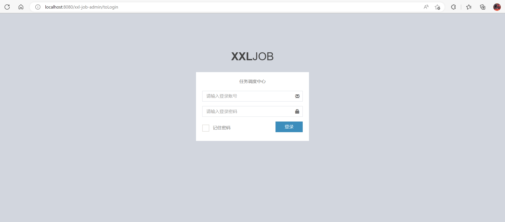

## 初次使用

拉下代码，可以看到xxl-job分为三个模块，分别是xxl-job-admin，xxl-job-core，xxl-job-executor-samples

xxl-job-admin模块需要事先把数据库表导入到MySQL中，启动起来后可以打开xxl-job管理系统的后台网站，本地启动打开http://localhost:8080/xxl-job-admin

用户名：admin

密码：123456

启动起来后的界面如下：



xxl-job-core模块是核心模块，这个模块是打成jar包供日常项目使用。

xxl-job-executor-samples模块是示例，目前提供了Java无框架版本和Spring框架版本。

## 示例模块源码阅读

笔者就不参考Java无框架版本的示例代码了，因为我本次阅读源码后，会尝试编写另一份xxl-job，当然这也是后话。

Spring框架版本在xxl-job-executor-samples--->xxl-job-executor-sample-springboot模块。


从代码结构中可以看出来，这是一个标准的SpringBoot项目。

在pom文件中需要引入xxl-job-core依赖。

```xml
<!-- xxl-job-core -->
<dependency>
    <groupId>com.xuxueli</groupId>
    <artifactId>xxl-job-core</artifactId>
    <version>${project.parent.version}</version>
</dependency>
```


我们重点关注XxlJobConfig类和application.properties文件，因为这两个文件跟xxl-job有关系，其他的都是可扩展的。

com.xxl.job.executor.core.config.XxlJobConfig

```java
@Configuration
public class XxlJobConfig {
    private Logger logger = LoggerFactory.getLogger(XxlJobConfig.class);

    @Value("${xxl.job.admin.addresses}")
    private String adminAddresses;

    @Value("${xxl.job.accessToken}")
    private String accessToken;

    @Value("${xxl.job.executor.appname}")
    private String appname;

    @Value("${xxl.job.executor.address}")
    private String address;

    @Value("${xxl.job.executor.ip}")
    private String ip;

    @Value("${xxl.job.executor.port}")
    private int port;

    @Value("${xxl.job.executor.logpath}")
    private String logPath;

    @Value("${xxl.job.executor.logretentiondays}")
    private int logRetentionDays;


    @Bean
    public XxlJobSpringExecutor xxlJobExecutor() {
        logger.info(">>>>>>>>>>> xxl-job config init.");
        XxlJobSpringExecutor xxlJobSpringExecutor = new XxlJobSpringExecutor();
        xxlJobSpringExecutor.setAdminAddresses(adminAddresses);
        xxlJobSpringExecutor.setAppname(appname);
        xxlJobSpringExecutor.setAddress(address);
        xxlJobSpringExecutor.setIp(ip);
        xxlJobSpringExecutor.setPort(port);
        xxlJobSpringExecutor.setAccessToken(accessToken);
        xxlJobSpringExecutor.setLogPath(logPath);
        xxlJobSpringExecutor.setLogRetentionDays(logRetentionDays);
        return xxlJobSpringExecutor;
    }
}
```

application.properties

```properties
# web port
server.port=8081
# no web
#spring.main.web-environment=false
# log config
logging.config=classpath:logback.xml
### xxl-job admin address list, such as "http://address" or "http://address01,http://address02"
xxl.job.admin.addresses=http://127.0.0.1:8080/xxl-job-admin
### xxl-job, access token
xxl.job.accessToken=default_token
### xxl-job executor appname
xxl.job.executor.appname=xxl-job-executor-sample
### xxl-job executor registry-address: default use address to registry , otherwise use ip:port if address is null
xxl.job.executor.address=
### xxl-job executor server-info
xxl.job.executor.ip=
xxl.job.executor.port=9999
### xxl-job executor log-path
xxl.job.executor.logpath=/data/applogs/xxl-job/jobhandler
### xxl-job executor log-retention-days
xxl.job.executor.logretentiondays=30
```

根据这两个文件可以看出来，在使用xxl-job的时候，Spring项目中需要配置连接xxl-job后台的参数，然后编写配置类XxlJobConfig将这些参数值注册到名为xxlJobExecutor的bean中。

这些参数是什么意思我们这里暂时不管，配置好后，我们就可以编写我们的示例了。

示例代码在com.xxl.job.executor.service.jobhandler.SampleXxlJob类中，需要使用@Component主要标注

我们截取简单示例：

```java
/**
  * 1、简单任务示例（Bean模式）
	*/
@XxlJob("demoJobHandler")
public void demoJobHandler() throws Exception {
    XxlJobHelper.log("XXL-JOB, Hello World.");
    for (int i = 0; i < 5; i++) {
        XxlJobHelper.log("beat at:" + i);
        TimeUnit.SECONDS.sleep(2);
    }
    // default success
}
```

阅读简单示例后，我们得知需要在方法上加上@XxlJob注解，并添入jobhandler的名称“demoJobHandler”，表明我是一个任务

这个注解点进去可以看到：

```java
@Target({ElementType.METHOD})
@Retention(RetentionPolicy.RUNTIME)
@Inherited
public @interface XxlJob {

    /**
     * jobhandler name
     */
    String value();

    /**
     * init handler, invoked when JobThread init
     */
    String init() default "";

    /**
     * destroy handler, invoked when JobThread destroy
     */
    String destroy() default "";

}
```

里面有三个方法，value()表示任务处理器的名称，init和destroy表示任务的初始化和销毁的扩展方法。

回到示例代码中，这是一个简单的输出日志的任务。使用XxlJobHelper.log打印日志，该日志不会在控制台中打印，而是会在xxl-job的后台日志系统中展示出来。

## XxlJobExecutor类执行流程

回到示例代码的XxlJobConfig文件中，我们可以看到这里注册了一个名为XxlJobSpringExecutor的bean，阅读XxlJobSpringExecutor类的代码，发现这个类实现了ApplicationContextAware, SmartInitializingSingleton, DisposableBean，继承了XxlJobExecutor。

ApplicationContextAware：

> 在某些特殊的情况下，Bean需要实现某个功能，但该功能必须借助于Spring容器才能实现，此时就必须让该Bean先获取Spring容器，然后借助于Spring容器实现该功能。为了让Bean获取它所在的Spring容器，可以让该Bean实现ApplicationContextAware接口。ApplicationContextAware 通过它Spring容器会自动把上下文环境对象调用ApplicationContextAware接口中的setApplicationContext方法。在ApplicationContextAware的实现类中，就可以通过这个上下文环境对象得到Spring容器中的Bean。看到—Aware就知道是干什么的了，就是属性注入的，但是这个ApplicationContextAware的不同地方在于，实现了这个接口的bean，当spring容器初始化的时候，会自动的将ApplicationContext注入进来。

SmartInitializingSingleton：

> 在BeanFactory引导期间的单例预实例化阶段结束时触发的回调接口。这个接口可以由单例 bean 实现，以便在常规单例实例化算法之后执行一些初始化，避免意外早期初始化（例如来自ListableBeanFactory.getBeansOfType调用）的副作用。从这个意义上说，它是InitializingBean的替代方案，它在 bean 的本地构造阶段结束时立即触发。
> 这个回调变体有点类似于org.springframework.context.event.ContextRefreshedEvent但不需要org.springframework.context.ApplicationListener的实现，不需要跨上下文层次结构过滤上下文引用等。它还意味着更多对beans包的最小依赖，并且被独立的ListableBeanFactory实现所尊重，而不仅仅是在org.springframework.context.ApplicationContext环境中。
> 注意：如果您打算启动/管理异步任务，最好实现org.springframework.context.Lifecycle代替它为运行时管理提供更丰富的模型并允许分阶段启动/关闭。

DisposableBean：

> 由想要在销毁时释放资源的 bean 实现的接口。 BeanFactory将在作用域 bean 的单独销毁时调用 destroy 方法。一个org.springframework.context.ApplicationContext应该在应用程序生命周期的驱动下在关闭时处理它的所有单例。
> Spring 管理的 bean 也可以实现 Java 的AutoCloseable接口用于相同的目的。

以上是Spring相关的三个类的说明。

我们先看XxlJobExecutor这个类。

xxl-job的编写者已经对该类进行了分层说明：

```java
// ---------------------- param ----------------------
// ---------------------- start + stop ----------------------
// ---------------------- admin-client (rpc invoker) ----------------------
// ---------------------- executor-server (rpc provider) ----------------------
// ---------------------- job handler repository ----------------------
// ---------------------- job thread repository ----------------------
```

该类的结构分为六层。

param层我们可以看到，这些类变量和我们在示例工程中，看到的XxlJobConfig类中配置的参数是一样的，也就说明，我们之前配置application.propertied文件中的参数都会在这里用到。

```java
private String adminAddresses;
private String accessToken;
private String appname;
private String address;
private String ip;
private int port;
private String logPath;
private int logRetentionDays;
```


