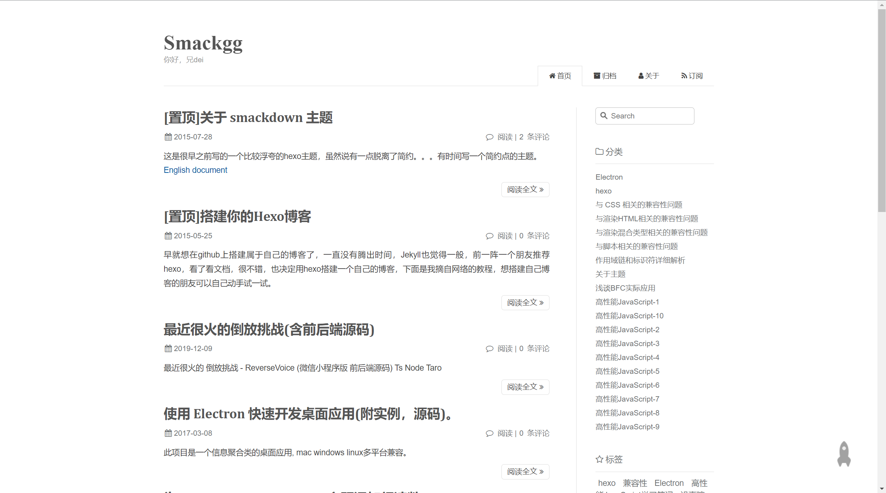
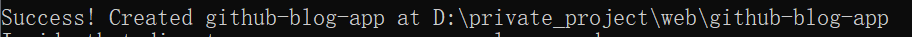
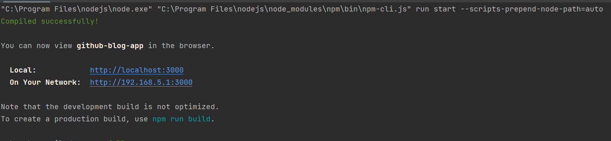
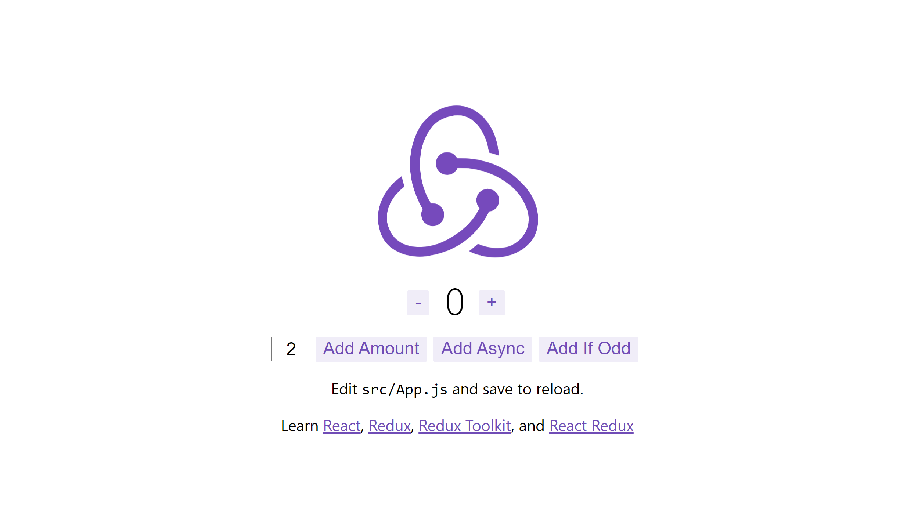
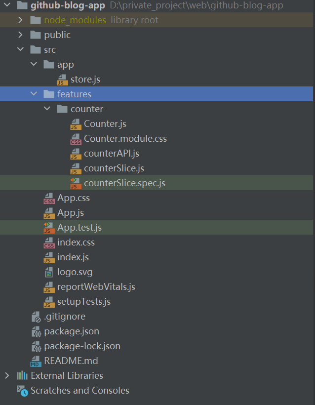

# 博客系统前台使用React搭建和GitHubIssue一起使用

一直想搭建一个博客平台，尝试过wordpress、typecho、hexo，hexo有很大的学习成本，wordpress和typecho又需要服务器，所以我想自己自定义一个博客系统。

最近我正好也学习了React，用这个博客系统来练练手也不错。

搭建一个博客系统的目的有几个：

1. 我想思考出一种自己的前端编码方式，因为我是后端转前端，所以对于这些事物还是有些迷茫的。
2. 编写一个项目的时候，学习下项目的流程，具体使用哪些技术栈等等。

这个博客系统的技术栈有点多，我会使用React作为JavaScript的技术支持，Less作为CSS层叠样式表的框架。一步一步的规划编码的流程。

## 一、基础知识

学习设计一套系统，需要学习很多的技能知识。

以下是搭建这一套博客系统需要学习的技能点，及学习网站的跳转链接。

[React](https://react.docschina.org/)、[Html+Css+JavaScript](https://developer.mozilla.org/zh-CN/docs/Learn/Getting_started_with_the_web)、[~~Less~~](https://less.bootcss.com/)、[React Redux](https://cn.redux.js.org/)、[React Route](https://reactrouter.com/en/main)、[Github API](https://docs.github.com/cn)、[PureCss](https://purecss.io/)

## 二、架构设计

学会了知识之后，我们就要针对我们的网站架构进行一个初步的探讨。

首先我对于我的网站定义为博客网站。

主要功能就是为了展示我利用GitHubIssue发布的博客内容。

也就是说，我只需要展示文章内容即可，顺便在首页展示一些标签、分类等等，毕竟我要分享的仅仅是文章而已。

我不需要设计广告模块来挣取广告费，我想让我的网站变得更加简洁。

我不需要设计内容后台管理系统，因为我们是通过GitHubIssue来管理文章的。

所以这个系统的架构可以简单概括为：

用户->首页->展示文章列表->用户点进文章->展示文章内容->用户跳转GitHubIssue页面进行评论。

ok，这是我网站的架构逻辑，十分简单，也很实用。

## 三、UI设计

对于UI设计，我并不了解多少，我给我的博客打的标签是简洁、高效。

简洁即页面清爽，没有什么不必要的内容，用户打开即食。

高效即内容清晰可见，用户对于内容没有任何困扰。

所以我在Hexo的主题网上找到了这个网站，[smackkgg](https://blog.smackgg.cn/)，这个网站的风格蛮适合我的。



所以我的博客大致长这样。

## 四、项目搭建

UI设计确定后，我开始搭建自己的项目。

由于我要使用React，所以使用React自带的create-react-app搭建是最好的，这样节省了我很多时间。

另外我还要使用Redux做数据管理，所以我需要在创建项目的命令后面加上`--template redux`。

整体的命令就是：

```cmd
npx create-react-app github-blog-app --template redux
```

打开命令行输入这行命令。

Lucky！网络比较良好，项目很快就创建成功了。



我们使用IDE导入这个项目，并启动。



启动成功后我们在浏览器打开：localhost:3000



我们会发现出现的是Redux默认自带的计数器应用。

目前的项目结构是：



对于基础不好的读者而言，可能需要你去学习下React的基础知识。

我们需要引入purecss，打开public文件夹的index.html文件，将其引入即可。

```html
<link rel="stylesheet" href="https://cdn.jsdelivr.net/npm/purecss@3.0.0/build/pure-min.css" integrity="sha384-X38yfunGUhNzHpBaEBsWLO+A0HDYOQi8ufWDkZ0k9e0eXz/tH3II7uKZ9msv++Ls" crossorigin="anonymous">
```

至此，项目搭建好了。

## 五、导航栏设计

